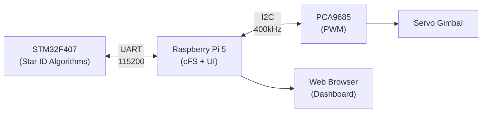

# Stellar Navigation Demonstration System

Desktop demonstration of spacecraft stellar navigation using real-time star identification algorithms with NASA cFS integration.

**Status**: Development Phase  
**Target**: Educational demonstration with flight-software architecture

---

## System Overview



**Data Flow:**

1. STM32 runs star identification → Outputs quaternion attitude
2. Raspberry Pi cFS STARNAV_APP receives via UART → Software Bus
3. Python bridge subscribes to Software Bus → Controls servos + WebSocket
4. Web browser displays 3D spacecraft + telemetry in real-time

---

## Quick Start

### 🎯 For Beginners

Follow the component guides in order:

1. **[Hardware Integration](docs/components/hardware-integration.md)** - Shopping list, wiring, power
2. **[Raspberry Pi Setup](docs/components/raspberry-pi-setup.md)** - Pi 5 configuration
3. **[cFS Integration](docs/components/cfs-integration.md)** - NASA flight software
4. **[STM32 Firmware](docs/components/stm32-firmware.md)** - Algorithm implementation
5. **[Web Dashboard](docs/components/web-dashboard.md)** - Real-time visualization

### ⚡ For Experienced Users

```bash
# 1. Clone and setup cFS
git clone <repo-url> ~/workspace/stellar-navigation
cd ~/workspace/stellar-navigation
./scripts/setup-cfs.sh

# 2. Build cFS
cd cfs && make SIMULATION=native prep && make -j$(nproc) && make install

# 3. Build firmware (future)
cd ../firmware && make flash

# 4. Run system
cd ~/workspace/stellar-navigation/cfs/build/exe/cpu1 && ./core-cpu1 &
cd ~/workspace/stellar-navigation/dashboard && python3 cfs_bridge.py

# 5. Open browser: http://localhost:5000
```

---

## Project Structure

```text
stellar-navigation/
├── cfs/                       # NASA Core Flight System (submodule, pristine)
├── cfs-mission/               # Mission-specific files
│   ├── Makefile               # Build configuration
│   ├── sample_defs/           # Target configuration
│   └── apps/starnav/          # Custom STARNAV application
├── dashboard/                 # Web UI
│   ├── cfs_bridge.py          # Python middleware
│   ├── servo_control.py       # Gimbal control
│   └── templates/             # HTML templates
├── docs/
│   ├── components/            # Component-specific guides ⭐ START HERE
│   │   ├── hardware-integration.md
│   │   ├── stm32-firmware.md
│   │   ├── raspberry-pi-setup.md
│   │   ├── cfs-integration.md
│   │   └── web-dashboard.md
│   └── setup/                 # Legacy setup guides
├── firmware/                  # STM32 firmware
├── scripts/                   # Build and utility scripts
├── test-data/                 # Synthetic star observations
├── DEVELOPMENT_CHECKLIST.md   # Progress tracking
└── README.md                  # This file
```

---

## Hardware Requirements

**Total Cost**: ~$170-200

| Component            | Purpose               | Est. Cost |
| -------------------- | --------------------- | --------- |
| STM32F407VET6        | Algorithm execution   | $10-20    |
| Raspberry Pi 5 (4GB) | cFS host + UI         | $60-80    |
| PCA9685 + Servos     | Gimbal control        | $25-35    |
| Power supplies       | USB-C 27W + 6V/3A     | $30       |
| MicroSD + Wiring     | Storage + connections | $25       |

**See [Hardware Integration Guide](docs/components/hardware-integration.md) for complete list**

---

## Documentation

### 📘 Component Guides (Start Here)

- **[Hardware Integration](docs/components/hardware-integration.md)** - Shopping, wiring, power distribution
- **[STM32 Firmware](docs/components/stm32-firmware.md)** - Microcontroller setup and algorithms
- **[Raspberry Pi Setup](docs/components/raspberry-pi-setup.md)** - Pi 5 configuration
- **[cFS Integration](docs/components/cfs-integration.md)** - NASA flight software framework
- **[Web Dashboard](docs/components/web-dashboard.md)** - Real-time visualization

### 📋 Reference Documentation

- **[Development Checklist](DEVELOPMENT_CHECKLIST.md)** - Track implementation progress
- **[Stellar Nav Quick Ref](docs/stellar_nav_quick_ref.md)** - Command reference

### 🗂️ Legacy Documentation

- `docs/setup/pi5_setup.md` - Replaced by component guides
- `stellar_navigation_hardware_guide.md` - Replaced by component guides

---

## Key Features

### ✅ Implemented

- [x] System architecture design
- [x] Component documentation structure
- [x] Hardware integration plans
- [x] cFS application framework

### 🔨 In Progress

- [ ] STM32 development environment
- [ ] Triangle algorithm implementation
- [ ] UART protocol testing
- [ ] Web dashboard development

### 📋 Planned

- [ ] Star catalog database
- [ ] TRIAD/QUEST attitude solvers
- [ ] Tracking mode with state estimation
- [ ] Telemetry logging and playback

---

## Performance Targets

| Metric               | Target | Notes                        |
| -------------------- | ------ | ---------------------------- |
| Lost-in-space time   | < 1s   | Initial attitude acquisition |
| Tracking update rate | 10 Hz  | Continuous tracking mode     |
| Success rate         | > 95%  | Star identification accuracy |
| Attitude accuracy    | < 0.1° | Angular error                |

---

## Troubleshooting

**UART not working?** → Verify TX/RX crossed, check baud rate (115200)  
**Servos jittery?** → Separate 6V power supply, add 1000µF capacitor  
**cFS build fails?** → Try `make -j2`, check dependencies  
**Dashboard not loading?** → Verify Flask on port 5000, check firewall

**See component guides for detailed troubleshooting**

---

## License

MIT License - see [LICENSE](LICENSE) file for details.

---

**Last Updated**: November 15, 2025  
**Repository**: https://github.com/rghsoftware/stellar-navigation
