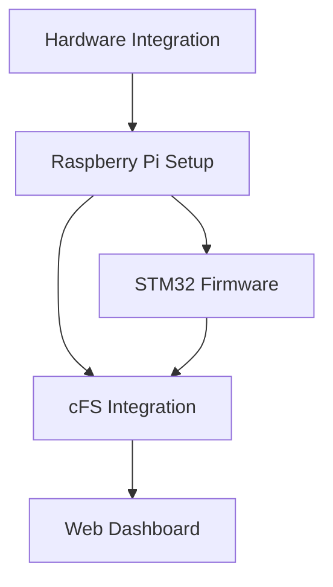

# Component Guides

**Purpose**: Detailed setup and integration guides for each system component

---

## Getting Started

Follow these guides **in order** for a complete system build:

### 1️⃣ [Hardware Integration](hardware-integration.md)

**Start here** - Complete shopping list, wiring diagrams, and power distribution.

**What you'll learn:**
- Component procurement (where to buy, what to look for)
- Wiring connections between all components
- Power supply requirements and safety
- Physical assembly and mounting

**Time**: 2-3 hours for assembly + testing

---

### 2️⃣ [Raspberry Pi Setup](raspberry-pi-setup.md)

Configure Raspberry Pi 5 as the system host.

**What you'll learn:**
- OS installation and configuration
- UART and GPIO setup (Pi 5 specific)
- Performance optimization
- Auto-start services

**Time**: 1-2 hours

---

### 3️⃣ [cFS Integration](cfs-integration.md)

Install NASA Core Flight System and create custom STARNAV app.

**What you'll learn:**
- cFS installation and build
- Software Bus messaging
- UART device driver development
- Custom application creation

**Time**: 3-4 hours

---

### 4️⃣ [STM32 Firmware](stm32-firmware.md)

Develop embedded firmware for star identification algorithms.

**What you'll learn:**
- STM32 development environment setup
- Clock and FPU configuration
- UART binary protocol implementation
- Algorithm implementation (Triangle/TRIAD/QUEST)

**Time**: 4-6 hours (ongoing development)

---

### 5️⃣ [Web Dashboard](web-dashboard.md)

Build real-time visualization and control interface.

**What you'll learn:**
- Flask WebSocket server
- Servo control with Pi 5 lgpio
- Three.js 3D rendering
- Real-time telemetry display

**Time**: 2-3 hours

---

## Quick Reference

### Component Dependencies

### Recommended Order

**Parallel Development (Efficient):**
1. Setup Raspberry Pi + cFS
2. Simultaneously develop STM32 firmware
3. Integrate via UART when both ready
4. Add dashboard for visualization

**Sequential Development (Easier):**
1. Assemble hardware (no power yet)
2. Setup Raspberry Pi
3. Install cFS
4. Setup STM32 development
5. Integrate UART communication
6. Build dashboard

---

## Support

**Issues?** Check the troubleshooting section in each component guide.

**Stuck?** 
1. Re-read the relevant component guide
2. Check the main `DEVELOPMENT_CHECKLIST.md`
3. Open an issue on GitHub

---

## Contributing to Documentation

Found an error? Have improvements?

1. Guides are written in Markdown
2. Keep format consistent with existing docs
3. Include troubleshooting for common issues
4. Test instructions before committing

---

**Last Updated**: November 15, 2025
