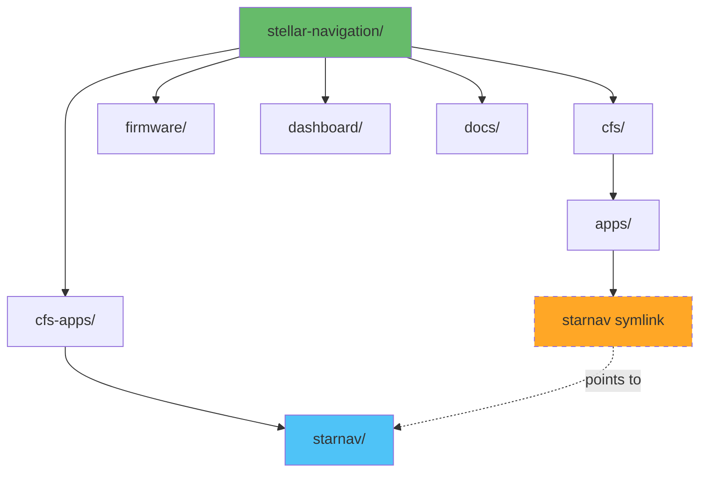

# cFS Integration Guide

**Component**: NASA Core Flight System (cFS)  
**Role**: Flight software framework and Software Bus messaging  
**Custom App**: STARNAV_APP for stellar navigation data

---

## Overview

This guide covers configuring cFS for the Stellar Navigation project and creating the STARNAV_APP custom application to receive attitude data from the STM32 and publish it to the Software Bus.

**Repository Architecture:**
- cFS is included as a git submodule (NASA's code)
- Custom build configuration (`Makefile`, `sample_defs/`) tracked in parent repo
- Custom apps (`starnav`) live in `cfs-apps/` and symlinked into `cfs/apps/`

**What cFS provides:**

- Flight-proven software framework
- Software Bus for message routing
- Executive Services for app management
- Time services and event logging
- Table management and commanding

---

## cFS Installation

### Project Structure Overview



**Key principle**: Custom apps live in `stellar-navigation/cfs-apps/`, NOT in the cFS submodule.

### Clone Repository

The cFS bundle is already included as a submodule in this project at `cfs/`.

**If starting fresh:**

```bash
# Clone the stellar-navigation repository
git clone <your-repo-url> ~/workspace/stellar-navigation
cd ~/workspace/stellar-navigation

# Initialize cFS submodule
git submodule update --init --recursive

# Verify cFS is present
ls cfs/cfe cfs/osal cfs/psp

# Verify custom build config is present
ls cfs/Makefile cfs/sample_defs/targets.cmake
```

**What gets cloned:**
- ✅ cFS submodule (NASA's code)
- ✅ Your custom `cfs/Makefile` (tracked in parent repo)
- ✅ Your custom `cfs/sample_defs/` (tracked in parent repo)
- ✅ Your custom apps in `cfs-apps/starnav/`

**Note**: The `cfs/Makefile` and `cfs/sample_defs/` are tracked by the parent repository using `git add --force`, not by the cFS submodule.

⏱️ **Time**: 5 minutes

**cFS directory structure:**

```
cfs/
├── cfe/          # Core Flight Executive
├── osal/         # Operating System Abstraction Layer
├── psp/          # Platform Support Package
├── apps/         # Lab apps + symlinks to your custom apps
│   ├── ci_lab/
│   ├── to_lab/
│   ├── sch_lab/
│   └── starnav -> ../../apps/starnav  # Symlink to YOUR app
└── tools/        # Ground system tools
```

**Your custom apps directory:**

```
stellar-navigation/cfs-apps/
└── starnav/      # Your custom flight software (tracked in your repo)
    ├── fsw/
    │   ├── mission_inc/
    │   ├── platform_inc/
    │   ├── src/
    │   └── tables/
    └── CMakeLists.txt
```

### Configure Build

**Copy sample configuration:**

```bash
cd ~/workspace/stellar-navigation/cfs

# Copy Makefile (if not already present)
cp cfe/cmake/Makefile.sample Makefile

# Copy configuration templates (if not already present)
cp -r cfe/cmake/sample_defs sample_defs
```

**Note**: These files should already exist in your repository. Only copy if starting fresh.

---

### 📝 Version Control for Build Configuration

**Important**: `Makefile` and `sample_defs/` live inside the `cfs/` submodule directory but contain **your project-specific configuration**.

**How this works:**
1. cFS submodule `.gitignore` ignores these files (they're meant to be customized)
2. Your parent repo tracks them using `git add --force`
3. This keeps your custom build config in your repo without modifying the submodule

**To track your customized build configuration:**

```bash
cd ~/workspace/stellar-navigation

# Force add files inside submodule directory
git add --force cfs/Makefile
git add --force cfs/sample_defs/

# Commit your custom configuration
git commit -m "Add custom cFS build configuration for stellar-navigation"

# Push to your repo
git push
```

**Why `--force`?**
- Normal `git add` won't track files inside a submodule directory
- `--force` bypasses this and tracks them in the parent repo
- cFS submodule remains unchanged (doesn't see these files)

**Result:**
- ✅ Your custom `targets.cmake` is version-controlled
- ✅ Fresh clone includes build configuration
- ✅ cFS submodule stays clean
- ✅ No conflicts when updating cFS submodule

---

**Edit target configuration:**

**File**: `~/workspace/stellar-navigation/cfs/sample_defs/targets.cmake`

```bash
nano sample_defs/targets.cmake
```

**Replace with:**

```cmake
# Raspberry Pi 5 ARM64 target configuration

# Mission-global apps (available to all CPUs)
# Note: Don't duplicate apps here if they're in cpu1_APPLIST
# list(APPEND MISSION_GLOBAL_APPLIST)

# Define CPU targets
list(APPEND MISSION_CPUNAMES cpu1)

# CPU1 configuration
set(cpu1_PROCESSORID 1)
set(cpu1_APPLIST ci_lab to_lab sch_lab)
set(cpu1_FILELIST cfe_es_startup.scr)
# Note: cpu1_SYSTEM not set - will use native toolchain when built with SIMULATION=native

# Platform selection for Raspberry Pi
set(cpu1_PSP pc-linux)

# Build options
set(ENABLE_UNIT_TESTS FALSE)
```

### Build cFS

```bash
cd ~/workspace/stellar-navigation/cfs

# Prepare build system for native build
make SIMULATION=native prep

# Build (uses all CPU cores)
make -j$(nproc)

# Install to build directory
make install
```

⏱️ **Time**: 30-45 minutes (first build)

⚠️ **If build fails with memory errors**: Use `make -j2` instead

**Build output location**: `~/workspace/stellar-navigation/cfs/build/exe/cpu1/`

---

### 💡 Cross-Platform Development Workflow

**`SIMULATION=native` builds for whatever platform you're currently on:**

| Platform         | Architecture | Build Command                         | Output Binary     |
| ---------------- | ------------ | ------------------------------------- | ----------------- |
| Desktop (x86_64) | x86_64       | `make SIMULATION=native prep && make` | x86_64 executable |
| Raspberry Pi 5   | ARM64        | `make SIMULATION=native prep && make` | ARM64 executable  |

**Key benefits:**

- ✅ **Same source code** on both platforms
- ✅ **Same configuration files** (no changes needed)
- ✅ **Same build commands** (no platform-specific flags)
- ✅ **Automatic architecture detection**

**Typical workflow:**

1. **Develop on desktop**: Edit code, build, test locally
2. **Push to git**: `git push`
3. **Pull on Pi**: `git pull`
4. **Build on Pi**: Same `make SIMULATION=native prep && make` command
5. **Deploy**: Binary is already built for Pi architecture

**Note**: Binaries are NOT portable between platforms - you must rebuild on each architecture.

### Test cFS

```bash
cd ~/workspace/stellar-navigation/cfs/build/exe/cpu1

# Run cFS
./core-cpu1
```

✅ **Expected output:**

```
CFE_PSP: Starting Up
CFE_ES_Main: Started
CFE_TIME: Clock initialized
CI_LAB: Initialized
TO_LAB: Initialized
SCH_LAB: Initialized
...
```

**Stop cFS**: Press Ctrl+C

**Note**: On desktop, this tests your development environment. On Raspberry Pi, this is the actual flight software.

---

## STARNAV_APP Development

### Important: App Location Strategy

**Your custom apps live in your repository, NOT in the cFS submodule.**

The starnav app is located at:

- **Source**: `~/workspace/stellar-navigation/cfs-apps/starnav/`
- **Symlink**: `~/workspace/stellar-navigation/cfs/apps/starnav` → `../../cfs-apps/starnav`

This approach keeps your flight software in your repo while allowing cFS to build it.

### Create App Structure

```bash
# Navigate to YOUR repository's apps directory (NOT cfs/apps!)
cd ~/workspace/stellar-navigation/cfs-apps

# Create directory structure (if not already present)
mkdir -p starnav/fsw/{mission_inc,platform_inc,src,tables}

# Create symlink so cFS can find it
cd ~/workspace/stellar-navigation/cfs/apps
ln -s ../../cfs-apps/starnav starnav

# Work in your repo's version
cd ~/workspace/stellar-navigation/cfs-apps/starnav
```

### Message ID Definitions

**Location**: `~/workspace/stellar-navigation/cfs-apps/starnav/fsw/platform_inc/starnav_msgid.h`

**Create `fsw/platform_inc/starnav_msgid.h`:** (note: singular, not plural)

```c
#ifndef STARNAV_MSGID_H
#define STARNAV_MSGID_H

/*
 * Message IDs for STARNAV application
 * Must be unique across all cFS apps
 *
 * Command MIDs: 0x18xx range
 * Telemetry MIDs: 0x08xx range
 */

/* Command Message IDs */
#define STARNAV_CMD_MID         0x1880
#define STARNAV_SEND_HK_MID     0x1881

/* Telemetry Message IDs */
#define STARNAV_HK_TLM_MID      0x0880
#define STARNAV_ATTITUDE_MID    0x0881
#define STARNAV_STATUS_MID      0x0882

#endif /* STARNAV_MSGID_H */
```

### Message Structures

**Location**: `~/workspace/stellar-navigation/cfs-apps/starnav/fsw/mission_inc/starnav_msg.h`

**Create `fsw/mission_inc/starnav_msg.h`:**

```c
#ifndef STARNAV_MSG_H
#define STARNAV_MSG_H

#include "cfe.h"

/*
 * Attitude Data Message
 * Matches STM32 UART packet format
 */
typedef struct {
    CFE_MSG_TelemetryHeader_t TlmHeader;

    /* Attitude quaternion (w, x, y, z) */
    float Quaternion[4];

    /* Euler angles in degrees (roll, pitch, yaw) */
    float EulerAngles[3];

    /* Confidence (0.0 to 1.0) */
    float Confidence;

    /* Number of stars matched */
    uint8_t NumStarsMatched;

    /* Operating mode */
    uint8_t OperatingMode;  // 0=idle, 1=tracking, 2=lost-in-space

    /* Device timestamp (milliseconds) */
    uint32_t DeviceTimestamp;

    /* cFE reception timestamp */
    CFE_TIME_SysTime_t CFE_Timestamp;

} STARNAV_AttitudeTlm_t;

/*
 * Status Telemetry Message
 */
typedef struct {
    CFE_MSG_TelemetryHeader_t TlmHeader;

    uint8_t  SystemState;
    uint8_t  StarsVisible;
    uint8_t  StarsMatched;
    float    ProcessingTimeMs;
    uint32_t DeviceUptime;
    uint16_t PacketsReceived;
    uint16_t PacketErrors;

} STARNAV_StatusTlm_t;

/*
 * Housekeeping Telemetry Message
 */
typedef struct {
    CFE_MSG_TelemetryHeader_t TlmHeader;

    uint8_t  CommandCounter;
    uint8_t  CommandErrorCounter;
    uint16_t DeviceErrors;
    uint32_t LastUpdateTime;

} STARNAV_HkTlm_t;

/*
 * No-Args Command
 */
typedef struct {
    CFE_MSG_CommandHeader_t CmdHeader;
} STARNAV_NoArgsCmd_t;

#endif /* STARNAV_MSG_H */
```

### Application Header

**Location**: `~/workspace/stellar-navigation/cfs-apps/starnav/fsw/src/starnav_app.h`

**Create `fsw/src/starnav_app.h`:**

```c
#ifndef STARNAV_APP_H
#define STARNAV_APP_H

#include "cfe.h"
#include "starnav_msg.h"
#include "starnav_msgid.h"

/* Performance IDs */
#define STARNAV_PERF_ID  91

/* Event IDs */
#define STARNAV_INIT_INF_EID      1
#define STARNAV_PIPE_ERR_EID      2
#define STARNAV_SUB_ERR_EID       3
#define STARNAV_DEV_ERR_EID       4
#define STARNAV_DEV_INF_EID       5

/* Pipe depths */
#define STARNAV_PIPE_DEPTH  32

/* Return codes */
#define STARNAV_NO_DATA  1

/* Application global data */
typedef struct {
    CFE_SB_PipeId_t  CommandPipe;
    uint32           RunStatus;

    /* Telemetry buffers */
    STARNAV_HkTlm_t       HkTlm;
    STARNAV_AttitudeTlm_t AttitudeTlm;
    STARNAV_StatusTlm_t   StatusTlm;

    /* Device handle */
    int DeviceFd;

} STARNAV_AppData_t;

/* Global data declaration */
extern STARNAV_AppData_t STARNAV_AppData;

/* Function prototypes */
void  STARNAV_Main(void);
int32 STARNAV_Init(void);
void  STARNAV_ProcessCommandPacket(CFE_SB_Buffer_t *SBBufPtr);
void  STARNAV_ProcessDeviceData(void);

/* Device functions */
int32 STARNAV_InitDevice(void);
int32 STARNAV_ReadDevice(void);
void  STARNAV_ProcessPacket(uint8_t *packet, uint16_t length);

#endif /* STARNAV_APP_H */
```

### UART Device Driver

**Location**: `~/workspace/stellar-navigation/cfs-apps/starnav/fsw/src/starnav_device.c`

**Create `fsw/src/starnav_device.c`:**

```c
#include "starnav_app.h"
#include <fcntl.h>
#include <termios.h>
#include <unistd.h>
#include <errno.h>
#include <string.h>

#define STARNAV_UART_DEVICE "/dev/ttyAMA0"
#define STARNAV_UART_BAUD   B115200
#define STARNAV_MAX_PACKET  128

/* Packet framing */
#define SYNC_BYTE_1  0xAA
#define SYNC_BYTE_2  0x55
#define MSG_ATTITUDE 0x01
#define MSG_STATUS   0x02

/* Initialize UART device */
int32 STARNAV_InitDevice(void)
{
    struct termios options;

    /* Open UART device */
    STARNAV_AppData.DeviceFd = open(STARNAV_UART_DEVICE,
                                     O_RDWR | O_NOCTTY | O_NONBLOCK);

    if (STARNAV_AppData.DeviceFd < 0) {
        CFE_EVS_SendEvent(STARNAV_DEV_ERR_EID, CFE_EVS_EventType_ERROR,
                         "Failed to open %s: %s",
                         STARNAV_UART_DEVICE, strerror(errno));
        return CFE_STATUS_EXTERNAL_RESOURCE_FAIL;
    }

    /* Get current settings */
    if (tcgetattr(STARNAV_AppData.DeviceFd, &options) < 0) {
        close(STARNAV_AppData.DeviceFd);
        return CFE_STATUS_EXTERNAL_RESOURCE_FAIL;
    }

    /* Configure UART */
    cfsetispeed(&options, STARNAV_UART_BAUD);
    cfsetospeed(&options, STARNAV_UART_BAUD);

    /* 8N1, no flow control, raw mode */
    options.c_cflag |= (CLOCAL | CREAD);
    options.c_cflag &= ~PARENB;
    options.c_cflag &= ~CSTOPB;
    options.c_cflag &= ~CSIZE;
    options.c_cflag |= CS8;
    options.c_cflag &= ~CRTSCTS;

    options.c_lflag &= ~(ICANON | ECHO | ECHOE | ISIG);
    options.c_iflag &= ~(IXON | IXOFF | IXANY);
    options.c_oflag &= ~OPOST;

    /* Apply settings */
    if (tcsetattr(STARNAV_AppData.DeviceFd, TCSANOW, &options) < 0) {
        close(STARNAV_AppData.DeviceFd);
        return CFE_STATUS_EXTERNAL_RESOURCE_FAIL;
    }

    CFE_EVS_SendEvent(STARNAV_DEV_INF_EID, CFE_EVS_EventType_INFORMATION,
                     "UART device opened: %s", STARNAV_UART_DEVICE);

    return CFE_SUCCESS;
}

/* Read from UART device */
int32 STARNAV_ReadDevice(void)
{
    uint8_t buffer[STARNAV_MAX_PACKET];
    ssize_t bytes_read;
    static uint8_t packet_buffer[STARNAV_MAX_PACKET];
    static int packet_index = 0;

    /* Read available data (non-blocking) */
    bytes_read = read(STARNAV_AppData.DeviceFd, buffer, sizeof(buffer));

    if (bytes_read < 0) {
        if (errno != EAGAIN && errno != EWOULDBLOCK) {
            CFE_EVS_SendEvent(STARNAV_DEV_ERR_EID, CFE_EVS_EventType_ERROR,
                             "UART read error: %s", strerror(errno));
            return CFE_STATUS_EXTERNAL_RESOURCE_FAIL;
        }
        return STARNAV_NO_DATA;
    }

    if (bytes_read == 0) {
        return STARNAV_NO_DATA;
    }

    /* Process bytes for packet framing */
    for (int i = 0; i < bytes_read; i++) {
        if (packet_index == 0 && buffer[i] == SYNC_BYTE_1) {
            packet_buffer[packet_index++] = buffer[i];
        }
        else if (packet_index == 1) {
            if (buffer[i] == SYNC_BYTE_2) {
                packet_buffer[packet_index++] = buffer[i];
            } else {
                packet_index = 0;
            }
        }
        else if (packet_index >= 2) {
            packet_buffer[packet_index++] = buffer[i];

            /* Check if we have complete packet */
            if (packet_index >= 4) {
                uint8_t msg_id = packet_buffer[2];
                uint8_t length = packet_buffer[3];
                uint16_t total_length = 4 + length + 2;  // header + payload + CRC

                if (packet_index >= total_length) {
                    STARNAV_ProcessPacket(packet_buffer, total_length);
                    packet_index = 0;
                }
                else if (packet_index >= STARNAV_MAX_PACKET) {
                    packet_index = 0;  // Reset on overflow
                }
            }
        }
    }

    return CFE_SUCCESS;
}

/* Process complete packet */
void STARNAV_ProcessPacket(uint8_t *packet, uint16_t length)
{
    uint8_t msg_id = packet[2];
    uint8_t *payload = &packet[4];

    /* TODO: Verify CRC */

    STARNAV_AppData.StatusTlm.PacketsReceived++;

    if (msg_id == MSG_ATTITUDE) {
        /* Parse attitude data */
        memcpy(&STARNAV_AppData.AttitudeTlm.Quaternion,
               payload, sizeof(float) * 4);
        memcpy(&STARNAV_AppData.AttitudeTlm.EulerAngles,
               payload + sizeof(float) * 4, sizeof(float) * 3);

        /* Add timestamp */
        STARNAV_AppData.AttitudeTlm.CFE_Timestamp = CFE_TIME_GetTime();

        /* Publish to Software Bus */
        CFE_SB_TimeStampMsg(CFE_MSG_PTR(STARNAV_AppData.AttitudeTlm.TlmHeader));
        CFE_SB_TransmitMsg(CFE_MSG_PTR(STARNAV_AppData.AttitudeTlm.TlmHeader),
                          true);
    }
}
```

### Main Application

**Location**: `~/workspace/stellar-navigation/cfs-apps/starnav/fsw/src/starnav_app.c`

**Create `fsw/src/starnav_app.c`:**

```c
#include "starnav_app.h"
#include <string.h>

/* Application global data */
STARNAV_AppData_t STARNAV_AppData;

/* Application entry point */
void STARNAV_Main(void)
{
    int32 status;
    CFE_SB_Buffer_t *SBBufPtr;

    CFE_ES_PerfLogEntry(STARNAV_PERF_ID);

    /* Initialize application */
    status = STARNAV_Init();
    if (status != CFE_SUCCESS) {
        STARNAV_AppData.RunStatus = CFE_ES_RunStatus_APP_ERROR;
    }

    /* Main loop */
    while (CFE_ES_RunLoop(&STARNAV_AppData.RunStatus)) {
        CFE_ES_PerfLogExit(STARNAV_PERF_ID);

        /* Wait for command (with timeout) */
        status = CFE_SB_ReceiveBuffer(&SBBufPtr,
                                     STARNAV_AppData.CommandPipe,
                                     100);

        CFE_ES_PerfLogEntry(STARNAV_PERF_ID);

        if (status == CFE_SUCCESS) {
            STARNAV_ProcessCommandPacket(SBBufPtr);
        }
        else if (status == CFE_SB_TIME_OUT) {
            /* Normal timeout - read device data */
            STARNAV_ProcessDeviceData();
        }
        else {
            CFE_EVS_SendEvent(STARNAV_PIPE_ERR_EID, CFE_EVS_EventType_ERROR,
                             "SB Read Error: 0x%08X", (unsigned int)status);
            STARNAV_AppData.RunStatus = CFE_ES_RunStatus_APP_ERROR;
        }
    }

    CFE_ES_ExitApp(STARNAV_AppData.RunStatus);
}

/* Initialize application */
int32 STARNAV_Init(void)
{
    int32 status;

    STARNAV_AppData.RunStatus = CFE_ES_RunStatus_APP_RUN;
    memset(&STARNAV_AppData, 0, sizeof(STARNAV_AppData));

    /* Register with Executive Services */
    CFE_ES_RegisterApp();

    /* Register events */
    status = CFE_EVS_Register(NULL, 0, CFE_EVS_EventFilter_BINARY);
    if (status != CFE_SUCCESS) return status;

    /* Create Software Bus pipe */
    status = CFE_SB_CreatePipe(&STARNAV_AppData.CommandPipe,
                              STARNAV_PIPE_DEPTH,
                              "STARNAV_CMD_PIPE");
    if (status != CFE_SUCCESS) return status;

    /* Subscribe to housekeeping requests */
    status = CFE_SB_Subscribe(CFE_SB_ValueToMsgId(STARNAV_SEND_HK_MID),
                             STARNAV_AppData.CommandPipe);
    if (status != CFE_SUCCESS) return status;

    /* Subscribe to ground commands */
    status = CFE_SB_Subscribe(CFE_SB_ValueToMsgId(STARNAV_CMD_MID),
                             STARNAV_AppData.CommandPipe);
    if (status != CFE_SUCCESS) return status;

    /* Initialize message headers */
    CFE_MSG_Init(CFE_MSG_PTR(STARNAV_AppData.HkTlm.TlmHeader),
                CFE_SB_ValueToMsgId(STARNAV_HK_TLM_MID),
                sizeof(STARNAV_AppData.HkTlm));

    CFE_MSG_Init(CFE_MSG_PTR(STARNAV_AppData.AttitudeTlm.TlmHeader),
                CFE_SB_ValueToMsgId(STARNAV_ATTITUDE_MID),
                sizeof(STARNAV_AppData.AttitudeTlm));

    /* Initialize UART device */
    status = STARNAV_InitDevice();
    if (status != CFE_SUCCESS) return status;

    CFE_EVS_SendEvent(STARNAV_INIT_INF_EID, CFE_EVS_EventType_INFORMATION,
                     "STARNAV App Initialized");

    return CFE_SUCCESS;
}

/* Process device data */
void STARNAV_ProcessDeviceData(void)
{
    int32 status = STARNAV_ReadDevice();

    if (status == CFE_SUCCESS) {
        STARNAV_AppData.HkTlm.LastUpdateTime = CFE_TIME_GetTime().Seconds;
    }
    else if (status != STARNAV_NO_DATA) {
        STARNAV_AppData.HkTlm.DeviceErrors++;
    }
}

/* Process command packet */
void STARNAV_ProcessCommandPacket(CFE_SB_Buffer_t *SBBufPtr)
{
    CFE_SB_MsgId_t MsgId = CFE_SB_INVALID_MSG_ID;
    CFE_MSG_GetMsgId(&SBBufPtr->Msg, &MsgId);

    switch (CFE_SB_MsgIdToValue(MsgId)) {
        case STARNAV_SEND_HK_MID:
            /* Send housekeeping telemetry */
            CFE_SB_TimeStampMsg(CFE_MSG_PTR(STARNAV_AppData.HkTlm.TlmHeader));
            CFE_SB_TransmitMsg(CFE_MSG_PTR(STARNAV_AppData.HkTlm.TlmHeader),
                              true);
            break;

        default:
            STARNAV_AppData.HkTlm.CommandErrorCounter++;
            break;
    }
}
```

### CMake Configuration

**Location**: `~/workspace/stellar-navigation/cfs-apps/starnav/CMakeLists.txt`

**Create `CMakeLists.txt`:**

```cmake
cmake_minimum_required(VERSION 3.5)
project(CFS_STARNAV C)

set(APP_SRC_FILES
    fsw/src/starnav_app.c
    fsw/src/starnav_device.c
)

add_cfe_app(starnav ${APP_SRC_FILES})

target_include_directories(starnav PUBLIC
    fsw/mission_inc
    fsw/platform_inc
)
```

---

## Build Configuration

### Add STARNAV to Build

**Prerequisites:**

1. STARNAV app exists at `~/workspace/stellar-navigation/cfs-apps/starnav/`
2. Symlink created: `~/workspace/stellar-navigation/cfs/apps/starnav` → `../../cfs-apps/starnav`

**Verify symlink:**

```bash
ls -la ~/workspace/stellar-navigation/cfs/apps/starnav
# Should show: starnav -> ../../cfs-apps/starnav
```

**Edit `~/workspace/stellar-navigation/cfs/sample_defs/targets.cmake`:**

```cmake
# Add starnav to cpu1 app list
SET(cpu1_APPLIST ci_lab to_lab sch_lab starnav)
```

### Configure Startup Script

**Edit `~/workspace/stellar-navigation/cfs/build/exe/cpu1/cfe_es_startup.scr`:**

Add after existing apps:

```
CFE_APP, starnav,     STARNAV_Main,    STARNAV,   50,  16384, 0x0, 0;
```

**Note**: This file is in the build output, not the source. You may need to edit the template at:
`~/workspace/stellar-navigation/cfs/sample_defs/cpu1_cfe_es_startup.scr`

### Rebuild cFS

```bash
cd ~/workspace/stellar-navigation/cfs

# Clean previous build
make distclean

# Reconfigure (SIMULATION=native works on both desktop and Pi)
make SIMULATION=native prep

# Build with STARNAV
make -j$(nproc)

# Install
make install
```

**Important Notes:**

- Your starnav source code changes are tracked in the `stellar-navigation` repository, not the `cfs` submodule
- Use the **same build commands** on desktop and Raspberry Pi
- After pulling code changes from git, just rebuild - no configuration changes needed

---

## Testing

### Run cFS with STARNAV

```bash
cd ~/workspace/stellar-navigation/cfs/build/exe/cpu1
./core-cpu1
```

✅ **Expected output:**

```
...
STARNAV App Initialized
UART device opened: /dev/ttyAMA0
...
```

### Monitor Software Bus

**In another terminal:**

```bash
cd ~/workspace/stellar-navigation/cfs/tools/cFS-GroundSystem

# Start ground system
python3 GroundSystem.py
```

---

## Next Steps

After cFS integration:

1. → See `web-dashboard.md` for UI development
2. → See `hardware-integration.md` for complete wiring
3. → See `raspberry-pi-setup.md` for servo control
