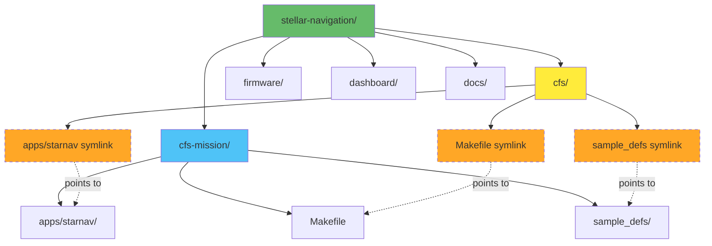
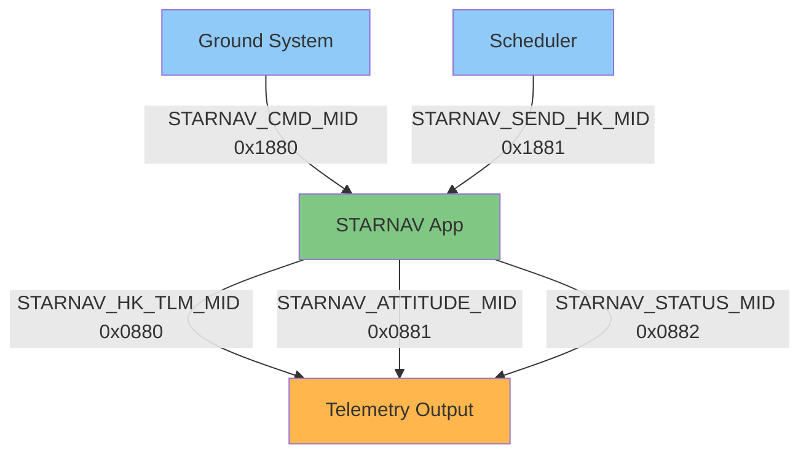
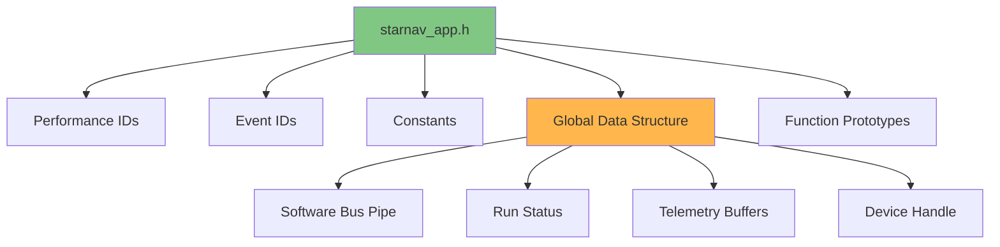
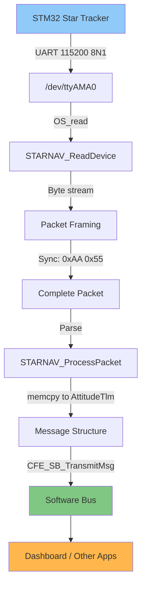
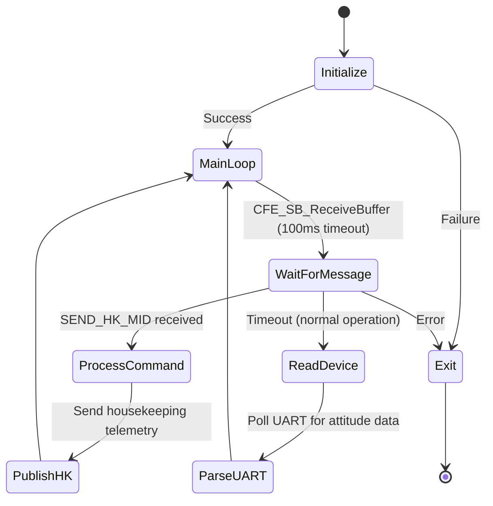
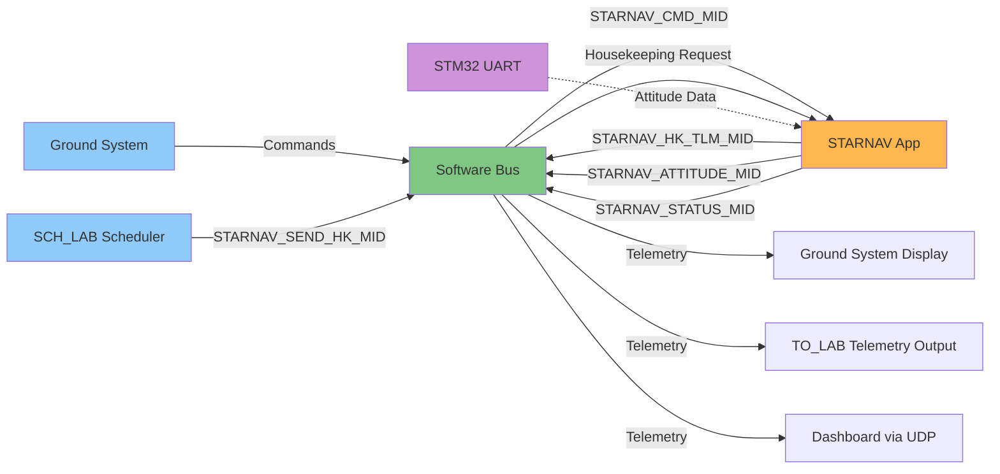

# cFS Integration Guide

**Component**: NASA Core Flight System (cFS)  
**Role**: Flight software framework and Software Bus messaging  
**Custom App**: STARNAV_APP for stellar navigation data

---

## Overview

This guide covers configuring cFS for the Stellar Navigation project and creating the STARNAV_APP custom application to
receive attitude data from the STM32 and publish it to the Software Bus.

**Repository Architecture:**

- cFS is included as a git submodule (NASA's code, unmodified)
- Mission-specific files live in `cfs-mission/` directory
- Build configuration and custom apps symlinked into `cfs/` for compilation
- Use `./scripts/setup-cfs.sh` to initialize everything automatically

**What cFS provides:**

- Flight-proven software framework
- Software Bus for message routing
- Executive Services for app management
- Time services and event logging
- Table management and commanding

---

## cFS Installation

### Project Structure Overview



**Key principle**: Mission-specific files live in `stellar-navigation/cfs-mission/`, NOT in the cFS submodule.

### Clone Repository

The cFS bundle is already included as a submodule in this project at `cfs/`.

**Initial setup:**

```bash
# Clone the stellar-navigation repository
git clone <your-repo-url> ~/workspace/stellar-navigation
cd ~/workspace/stellar-navigation

# Run setup script (initializes submodule and creates symlinks)
./scripts/setup-cfs.sh
```

**What the setup script does:**

1. Initializes cFS submodule (`git submodule update --init --recursive`)
2. Creates symlink: `cfs/Makefile` → `../cfs-mission/Makefile`
3. Creates symlink: `cfs/sample_defs` → `../cfs-mission/sample_defs`
4. Creates symlink: `cfs/apps/starnav` → `../../cfs-mission/apps/starnav`

**Verify setup:**

```bash
# Check cFS submodule
ls cfs/cfe cfs/osal cfs/psp

# Check symlinks
ls -l cfs/Makefile cfs/sample_defs cfs/apps/starnav
# Should show: -> ../cfs-mission/...
```

⏱️ **Time**: 5 minutes

**cFS directory structure:**

```text
cfs/
├── cfe/          # Core Flight Executive
├── osal/         # Operating System Abstraction Layer
├── psp/          # Platform Support Package
├── apps/         # Lab apps + symlinks to your custom apps
│   ├── ci_lab/
│   ├── to_lab/
│   ├── sch_lab/
│   └── starnav -> ../../apps/starnav  # Symlink to YOUR app
└── tools/        # Ground system tools
```

**Your mission directory:**

```text
stellar-navigation/cfs-mission/
├── Makefile              # Build configuration
├── sample_defs/          # Target & platform configuration
│   ├── targets.cmake
│   ├── cpu1_cfe_es_startup.scr
│   └── ...
└── apps/
    └── starnav/          # Your custom flight software
        ├── fsw/
        │   ├── mission_inc/
        │   ├── platform_inc/
        │   ├── src/
        │   └── tables/
        └── CMakeLists.txt
```

### Configure Build

**Note**: If you ran `./scripts/setup-cfs.sh`, the symlinks are already created. This section is for reference only.

**Manual setup (if needed):**

```bash
cd ~/workspace/stellar-navigation

# Create symlinks so cFS build finds mission config
ln -s ../cfs-mission/Makefile cfs/Makefile
ln -s ../cfs-mission/sample_defs cfs/sample_defs
ln -s ../../cfs-mission/apps/starnav cfs/apps/starnav
```

**Note**: Mission configuration files already exist in `cfs-mission/`.

---

### 📝 Version Control for Build Configuration

**Architecture**: All mission-specific files live in `cfs-mission/` and are tracked by git normally.

**How this works:**

1. `cfs-mission/` contains your Makefile, sample_defs, and custom apps
2. Symlinks in `cfs/` point to files in `cfs-mission/`
3. cFS submodule `.gitignore` ignores the symlinks (they're not tracked by the submodule)
4. Your parent repo tracks `cfs-mission/` normally

**To track your customized build configuration:**

```bash
cd ~/workspace/stellar-navigation

# Add mission files (normal git add, no --force needed)
git add cfs-mission/

# Commit your custom configuration
git commit -m "Add custom cFS build configuration for stellar-navigation"

# Push to your repo
git push
```

**Result:**

- ✅ Clean separation: NASA code in `cfs/`, your code in `cfs-mission/`
- ✅ cFS submodule stays pristine (never modified)
- ✅ No conflicts when updating cFS submodule
- ✅ All mission files version-controlled together

---

**Edit target configuration:**

**File**: `~/workspace/stellar-navigation/cfs-mission/sample_defs/targets.cmake`

**Key configuration elements:**

- **Mission-global apps**: Apps available to all CPUs (e.g., `sample_app`, `sample_lib`)
- **CPU targets**: Define processing units (typically `cpu1`)
- **App list**: Which apps run on each CPU (e.g., `ci_lab`, `to_lab`, `sch_lab`)
- **Platform Support Package**: Hardware abstraction layer (e.g., `pc-linux` for Raspberry Pi)
- **Build options**: Enable/disable features like unit tests

See actual file for Raspberry Pi 5 ARM64 configuration.

### Build cFS

```bash
cd ~/workspace/stellar-navigation/cfs

# Prepare build system for native build
make SIMULATION=native prep

# Build (uses all CPU cores)
make -j$(nproc)

# Install to build directory
make install
```

⏱️ **Time**: 30-45 minutes (first build)

⚠️ **If build fails with memory errors**: Use `make -j2` instead

**Build output location**: `~/workspace/stellar-navigation/cfs/build/exe/cpu1/`

---

### 💡 Cross-Platform Development Workflow

**`SIMULATION=native` builds for whatever platform you're currently on:**

| Platform         | Architecture | Build Command                         | Output Binary     |
| ---------------- | ------------ | ------------------------------------- | ----------------- |
| Desktop (x86_64) | x86_64       | `make SIMULATION=native prep && make` | x86_64 executable |
| Raspberry Pi 5   | ARM64        | `make SIMULATION=native prep && make` | ARM64 executable  |

**Key benefits:**

- ✅ **Same source code** on both platforms
- ✅ **Same configuration files** (no changes needed)
- ✅ **Same build commands** (no platform-specific flags)
- ✅ **Automatic architecture detection**

**Typical workflow:**

1. **Develop on desktop**: Edit code, build, test locally
2. **Push to git**: `git push`
3. **Pull on Pi**: `git pull`
4. **Build on Pi**: Same `make SIMULATION=native prep && make` command
5. **Deploy**: Binary is already built for Pi architecture

**Note**: Binaries are NOT portable between platforms - you must rebuild on each architecture.

### Test cFS

```bash
cd ~/workspace/stellar-navigation/cfs/build/exe/cpu1

# Run cFS
./core-cpu1
```

✅ **Expected output:**

```
CFE_PSP: Starting Up
CFE_ES_Main: Started
CFE_TIME: Clock initialized
CI_LAB: Initialized
TO_LAB: Initialized
SCH_LAB: Initialized
...
```

**Stop cFS**: Press Ctrl+C

**Note**: On desktop, this tests your development environment. On Raspberry Pi, this is the actual flight software.

---

## STARNAV_APP Development

### Important: App Location Strategy

**Custom apps live in `cfs-mission/apps/`, NOT in the cFS submodule.**

The starnav app is located at:

- **Source**: `~/workspace/stellar-navigation/cfs-mission/apps/starnav/`
- **Symlink**: `~/workspace/stellar-navigation/cfs/apps/starnav` → `../../cfs-mission/apps/starnav`

This approach keeps your flight software in your repo while allowing cFS to build it.

### Create App Structure

```bash
# Navigate to YOUR mission apps directory (NOT cfs/apps!)
cd ~/workspace/stellar-navigation/cfs-mission/apps

# Create directory structure (if not already present)
mkdir -p starnav/fsw/{mission_inc,platform_inc,src,tables}

# Create symlink so cFS can find it
cd ~/workspace/stellar-navigation/cfs/apps
ln -s ../../cfs-mission/apps/starnav starnav

# Work in your mission version
cd ~/workspace/stellar-navigation/cfs-mission/apps/starnav
```

### CMake Configuration

**Location**: `~/workspace/stellar-navigation/cfs-mission/apps/starnav/CMakeLists.txt`

**Purpose**: Tells cFS build system how to compile the app

**Key elements:**

- **Source files**: List all `.c` files (e.g., `starnav_app.c`, `starnav_device.c`)
- **App registration**: `add_cfe_app()` registers with cFE framework
- **Include directories**: Where to find header files (`mission_inc`, `platform_inc`)

See actual file for STARNAV configuration.

### Message ID Definitions

**Location**: `~/workspace/stellar-navigation/cfs-mission/apps/starnav/fsw/platform_inc/starnav_msgid.h`

**Purpose**: Unique identifiers for Software Bus message routing

**Message types:**



**Key concepts:**

- **Command MIDs** (`0x18xx`): Incoming commands to the app
- **Telemetry MIDs** (`0x08xx`): Outgoing data from the app
- **Must be unique** across all mission apps

See actual file for STARNAV message ID assignments.

### Message Structures

**Location**: `~/workspace/stellar-navigation/cfs-mission/apps/starnav/fsw/mission_inc/starnav_msg.h`

**Purpose**: Defines data structures sent over Software Bus

**STARNAV message types:**

| Message Type            | Contents                                         | Purpose                                 |
| ----------------------- | ------------------------------------------------ | --------------------------------------- |
| `STARNAV_AttitudeTlm_t` | Quaternion, Euler angles, confidence, star count | Primary attitude data from star tracker |
| `STARNAV_StatusTlm_t`   | System state, processing time, packet stats      | Device health monitoring                |
| `STARNAV_HkTlm_t`       | Command counters, error counts                   | Standard housekeeping                   |
| `STARNAV_NoArgsCmd_t`   | Command header only                              | Simple commands                         |

**Key design points:**

- **cFE headers**: All messages include standard cFE headers for routing
- **Timestamps**: cFE timestamp added when data received from hardware
- **Binary compatibility**: Structures must match between sender/receiver
- **Alignment**: C struct padding considerations for different platforms

See actual file for complete structure definitions matching STM32 UART packet format.

### Application Header

**Location**: `~/workspace/stellar-navigation/cfs-mission/apps/starnav/fsw/src/starnav_app.h`

**Purpose**: Central definitions and declarations for the app

**Key components:**



**Global data structure** (`STARNAV_AppData_t`):

- **CommandPipe**: Software Bus pipe for receiving commands
- **RunStatus**: App lifecycle state (running/stopping)
- **Telemetry buffers**: Pre-allocated message structures
- **DeviceFd**: UART device file descriptor

See actual file for complete definitions and STARNAV-specific constants.

### Device Interface Module

**Location**: `~/workspace/stellar-navigation/cfs-mission/apps/starnav/fsw/src/starnav_device.c`

**Purpose**: Interface with STM32 star tracker over UART

**Key functions:**

| Function                        | Purpose                                          |
| ------------------------------- | ------------------------------------------------ |
| `STARNAV_InitDevice()`          | Opens `/dev/ttyAMA0`, configures 115200 baud 8N1 |
| `STARNAV_ReadDevice()`          | Polls UART for incoming data                     |
| `STARNAV_ProcessPacket()`       | Parses framed packets, publishes to Software Bus |
| `STARNAV_ConfigureUART_Linux()` | Platform-specific UART setup using termios       |

**Data flow:**



**Packet framing protocol:**

- **Sync bytes**: `0xAA 0x55` mark start of packet
- **Message ID**: Identifies packet type (0x01=attitude, 0x02=status)
- **Length field**: Payload size
- **CRC**: Error detection (TODO: implement verification)

**OSAL abstraction**: Uses `OS_OpenCreate()` and `OS_read()` for portability across operating systems.

See actual file for complete UART configuration and packet parsing implementation.

### Main Application Module

**Location**: `~/workspace/stellar-navigation/cfs-mission/apps/starnav/fsw/src/starnav_app.c`

**Purpose**: Core app logic and cFS framework integration

**Key functions:**

| Function                         | Purpose                                            |
| -------------------------------- | -------------------------------------------------- |
| `STARNAV_Main()`                 | Entry point, main processing loop                  |
| `STARNAV_Init()`                 | Sets up Software Bus, registers events, opens UART |
| `STARNAV_ProcessCommandPacket()` | Handles housekeeping requests                      |
| `STARNAV_ProcessDeviceData()`    | Reads from UART device                             |

**Application lifecycle:**



**Initialization sequence:**

1. Clear global data structure
2. Register with Event Services (logging)
3. Create Software Bus pipe for commands
4. Subscribe to `STARNAV_SEND_HK_MID` (housekeeping requests)
5. Subscribe to `STARNAV_CMD_MID` (ground commands)
6. Initialize telemetry message headers
7. Open and configure UART device

**Main loop behavior:**

- Waits 100ms for Software Bus messages
- If command received → process it
- If timeout (normal) → read UART device for attitude data
- If error → exit application

**Telemetry publishing**: Calls `CFE_SB_TransmitMsg()` to send attitude data whenever complete packet received from STM32.

See actual file for complete cFS framework integration implementation.

---

## Build Configuration

### Add STARNAV to Build

**Prerequisites:**

1. STARNAV app exists at `~/workspace/stellar-navigation/cfs-mission/apps/starnav/`
2. Symlink created: `~/workspace/stellar-navigation/cfs/apps/starnav` → `../../cfs-mission/apps/starnav`

**Verify symlink:**

```bash
cd ~/workspace/stellar-navigation/cfs/apps
ls -l starnav

# Should show: starnav -> ../../cfs-mission/apps/starnav
```

**Edit `~/workspace/stellar-navigation/cfs-mission/sample_defs/targets.cmake`:**

Add `starnav` to the app list:

```cmake
SET(cpu1_APPLIST ci_lab to_lab sch_lab starnav)
```

### Configure Startup Script

**Edit `~/workspace/stellar-navigation/cfs-mission/sample_defs/cpu1_cfe_es_startup.scr`:**

Add STARNAV app startup entry:

```
CFE_APP, starnav, STARNAV_Main, STARNAV, 50, 16384, 0x0, 0;
```

**Parameters explained:**

- `starnav`: App name (lowercase, matches directory)
- `STARNAV_Main`: Entry point function
- `STARNAV`: App prefix for symbols
- `50`: Task priority (higher number = higher priority)
- `16384`: Stack size (16KB, sufficient for UART I/O)
- `0x0, 0`: Exception action flags (standard values)

### Rebuild cFS

```bash
cd ~/workspace/stellar-navigation/cfs

# Clean previous build
make distclean

# Reconfigure (SIMULATION=native works on both desktop and Pi)
make SIMULATION=native prep

# Build with STARNAV
make -j$(nproc)

# Install
make install

# Copy startup script
cp ../cfs-mission/sample_defs/cpu1_cfe_es_startup.scr build/exe/cpu1/cfe_es_startup.scr
```

**Important Notes:**

- Your starnav source code changes are tracked in the `stellar-navigation` repository, not the `cfs` submodule
- Use the **same build commands** on desktop and Raspberry Pi
- After pulling code changes from git, just rebuild - no configuration changes needed

---

## Testing

### Run cFS with STARNAV

```bash
cd ~/workspace/stellar-navigation/cfs/build/exe/cpu1
./core-cpu1
```

✅ **Expected output:**

```
...
STARNAV App Initialized
UART device opened: /dev/ttyAMA0
...
```

### Monitor Software Bus

**In another terminal:**

```bash
cd ~/workspace/stellar-navigation/cfs/tools/cFS-GroundSystem

# Start ground system
python3 GroundSystem.py
```

**Software Bus message flow:**



**What to verify:**

- STARNAV app starts without errors
- UART device opens successfully
- Attitude messages appear when STM32 sends data
- Housekeeping telemetry responds to scheduler requests

---

## Next Steps

After cFS integration:

1. → See `web-dashboard.md` for UI development
2. → See `hardware-integration.md` for complete wiring
3. → See `raspberry-pi-setup.md` for servo control
