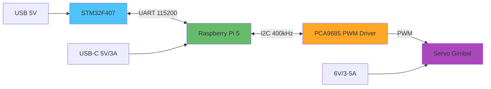
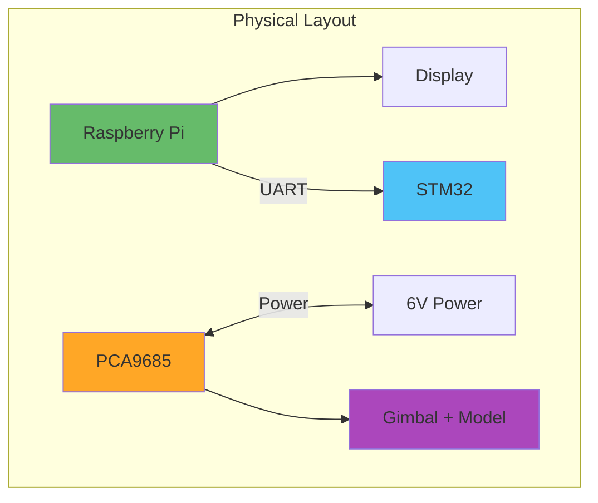

# Hardware Integration Guide

**Purpose**: Physical connections between all system components  
**Components**: STM32, Raspberry Pi 5, Gimbal, Power supplies

---

## System Architecture



---

## Shopping List

### Required Components

**Microcontroller:**
- STM32F407VET6 development board ($10-20)

**Single-Board Computer:**
- Raspberry Pi 5 (4GB or 8GB) ($60-80)
- 32GB+ microSD card, Class 10 ($10)
- USB-C power supply, 27W ($15)
- Active cooling (fan + heatsink) ($10)

**Gimbal System:**
- Arducam B0283 Pan-Tilt kit OR
- PCA9685 PWM board + 2× servos ($25-35)

**Power:**
- 6V 3-5A power supply for servos ($15)
- 1000µF capacitor (25V) ($2)

**Wiring:**
- Jumper wires (M-M, M-F, F-F) ($10)
- 22 AWG wire for power ($5)
- Breadboard for connections ($5)

**Total**: ~$170-200

---

## Power Distribution

### Critical Safety Rules

⚠️ **NEVER power servos from Pi GPIO pins** - Will damage Pi  
⚠️ **Always connect grounds together** - Prevents voltage differences  
⚠️ **Add capacitor to servo power** - Smooths voltage spikes

### Power Architecture

```mermaid
graph TB
    A[USB-C 27W] --> B[Raspberry Pi 5]
    C[6V 3-5A PSU] --> D[1000µF Cap]
    D --> E[PCA9685 V+]
    F[USB 5V] --> G[STM32F407]
    
    B --> H[Common Ground]
    C --> H
    E --> H
    F --> H
    G --> H
    
    style H fill:#333,stroke:#fff,stroke-width:3px
```



---

## Wiring Connections

### UART: STM32 ↔ Raspberry Pi

| STM32 Pin | Function | Wire Color | Pi GPIO | Physical Pin |
|-----------|----------|------------|---------|--------------|
| PA2 | TX | Orange | 15 (RX) | Pin 10 |
| PA3 | RX | Yellow | 14 (TX) | Pin 8 |
| GND | Ground | Black | GND | Pin 6 |

**Notes:**
- TX on STM32 connects to RX on Pi (crossed)
- RX on STM32 connects to TX on Pi (crossed)
- 3.3V logic levels - directly compatible

### I2C: Raspberry Pi ↔ PCA9685

| Pi GPIO | Function | Wire Color | PCA9685 Pin |
|---------|----------|------------|-------------|
| 2 (SDA) | Data | Blue | SDA |
| 3 (SCL) | Clock | Green | SCL |
| 5V | Power | Red | VCC |
| GND | Ground | Black | GND |

**Notes:**
- Built-in pull-ups on PCA9685
- 400kHz I2C clock speed
- Default address: 0x40

### PWM: PCA9685 ↔ Servos

| PCA9685 | Function | Servo Pin |
|---------|----------|-----------|
| Channel 0 | Pan signal | Signal (orange/white) |
| Channel 1 | Tilt signal | Signal (orange/white) |
| V+ | Servo power | Power (red) |
| GND | Servo ground | Ground (brown/black) |

**Separate Power Required:**
- Connect 6V power supply to PCA9685 V+ terminal
- Connect 1000µF capacitor across V+ and GND
- **DO NOT** connect V+ to Pi 5V pin

---

## Step-by-Step Assembly

### Phase 1: Component Testing (Individually)

**Test 1: STM32**
```bash
# Connect USB to computer
# Check for power LED
# Enter DFU mode (BOOT0=1, reset)
dfu-util -l
# Should show STM32 device
```

**Test 2: Raspberry Pi**
```bash
# Boot with prepared SD card
# SSH into Pi
ping starnav-demo.local
# Check UART exists
ls -l /dev/ttyAMA0
```

**Test 3: PCA9685**
```bash
# Connect to Pi I2C only (no servos yet)
# Power on Pi
i2cdetect -y 1
# Should show 0x40
```

### Phase 2: Wiring (Power Off)

**Step 1: Create ground bus**
```
Use breadboard power rail as common ground point
Connect all component grounds here
```

**Step 2: UART wiring**
```
STM32 PA2 → Orange wire → Pi GPIO 15
STM32 PA3 → Yellow wire → Pi GPIO 14
STM32 GND → Black wire → Ground bus
```

**Step 3: I2C wiring**
```
Pi GPIO 2 → Blue wire → PCA9685 SDA
Pi GPIO 3 → Green wire → PCA9685 SCL
Pi GND → Black wire → Ground bus
PCA9685 GND → Black wire → Ground bus
```

**Step 4: Servo wiring (don't apply power yet)**
```
Servo 0 signal → PCA9685 Channel 0
Servo 1 signal → PCA9685 Channel 1
Both servo power (red) → PCA9685 V+ terminal
Both servo ground (black) → PCA9685 GND terminal
```

**Step 5: Servo power preparation**
```
Solder 1000µF capacitor across V+ and GND terminals
  - Negative leg (stripe) to GND
  - Positive leg to V+
Connect 6V power supply to V+ terminal
  - Positive to V+
  - Negative to GND (which connects to ground bus)
```

### Phase 3: Power-Up Sequence

**Critical Order:**

1. **Pi only** (no servo power):
   ```bash
   # Connect Pi USB-C
   # Boot and SSH in
   i2cdetect -y 1
   # Verify PCA9685 appears at 0x40
   ```

2. **Add STM32** (still no servo power):
   ```bash
   # Connect STM32 USB
   # Test UART communication
   screen /dev/ttyAMA0 115200
   # Power on STM32, should see data
   ```

3. **Finally, servo power**:
   ```bash
   # Connect 6V supply
   # Run servo test
   python3 servo_control.py
   # Servos should move smoothly
   ```

---

## Verification Tests

### Test 1: UART Loopback

**On Pi:**
```bash
# Terminal 1: Read
cat /dev/ttyAMA0

# Terminal 2: Write
echo "test" > /dev/ttyAMA0

# Should see "test" in Terminal 1
```

### Test 2: I2C Scan

```bash
i2cdetect -y 1

# Expected output:
#      0  1  2  3  4  5  6  7  8  9  a  b  c  d  e  f
# 00:                         -- -- -- -- -- -- -- --
# ...
# 40: 40 -- -- -- -- -- -- -- -- -- -- -- -- -- -- --
```

### Test 3: Servo Range

```python
from gpiozero import Servo
from gpiozero.pins.lgpio import LGPIOFactory
import time

factory = LGPIOFactory()
servo = Servo(17, pin_factory=factory)

# Test range
servo.min()
time.sleep(1)
servo.mid()
time.sleep(1)
servo.max()
time.sleep(1)
servo.mid()

servo.close()
```

---

## Troubleshooting

### Issue: UART data corrupted

**Diagnostic:**
```bash
# Check baud rate
stty -F /dev/ttyAMA0

# Should show: speed 115200
```

**Solutions:**
- Verify TX/RX crossed correctly
- Check ground connection solid
- Try shorter wires (< 30cm ideal)
- Add 1kΩ pull-up resistors if needed

### Issue: I2C device not found

**Diagnostic:**
```bash
# Check I2C enabled
ls /dev/i2c-1

# Check for voltage on SDA/SCL
# Should be ~3.3V when idle (pull-ups)
```

**Solutions:**
- Verify SDA/SCL not swapped
- Check PCA9685 powered (VCC = 5V)
- Try different I2C address (A0-A5 pins)
- Verify Pi I2C enabled in raspi-config

### Issue: Servos jittery

**Causes & Fixes:**
- Weak power supply → Use 3A+ rated
- Missing capacitor → Add 1000µF
- Long power wires → Use 22 AWG, < 1m
- Ground loop → Single ground point only

### Issue: Pi reboots randomly

**Causes & Fixes:**
- Insufficient power → Use official 27W supply
- Voltage drop → Short, thick USB-C cable
- Servo backfeed → Verify separate power supplies
- Overheating → Add active cooling

---

## Physical Mounting

### Recommended Layout



**Tips:**
- Mount on plywood/MDF base
- Cable management ties
- Label all connections
- Leave access to reset buttons
- Ventilation for Pi cooling

---

## Pin Reference Card

**Print and keep near workspace:**

| Component | Pin | Function | Connects To |
|-----------|-----|----------|-------------|
| STM32 | PA2 | TX | Pi GPIO 15 |
| STM32 | PA3 | RX | Pi GPIO 14 |
| STM32 | GND | Ground | Ground bus |
| Pi | GPIO 2 | I2C SDA | PCA9685 SDA |
| Pi | GPIO 3 | I2C SCL | PCA9685 SCL |
| Pi | GPIO 14 | UART TX | STM32 PA3 |
| Pi | GPIO 15 | UART RX | STM32 PA2 |
| Pi | GPIO 17 | Servo PWM* | (via lgpio) |
| Pi | GPIO 27 | Servo PWM* | (via lgpio) |
| PCA9685 | Ch 0 | Pan PWM | Servo 0 |
| PCA9685 | Ch 1 | Tilt PWM | Servo 1 |

*Note: Pi GPIO used only when PCA9685 not available

---

## Next Steps

After hardware integration:
1. → See `web-dashboard.md` for UI development
2. → See `stm32-firmware.md` for algorithm implementation
3. → See `cfs-integration.md` for software testing
