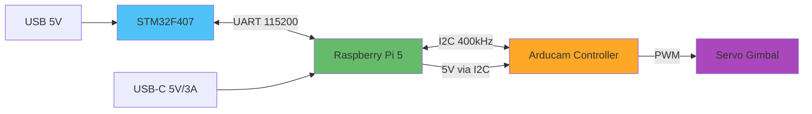
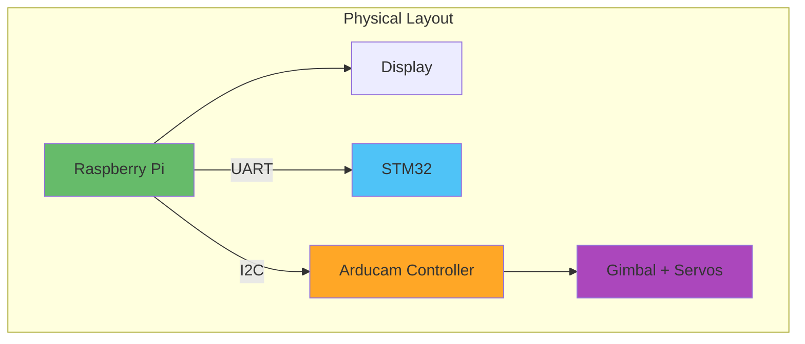

# Hardware Integration Guide

**Purpose**: Physical connections between all system components  
**Components**: STM32, Raspberry Pi 5, Gimbal, Power supplies

---

## System Architecture



---

## Shopping List

### Required Components

**Microcontroller:**

- STM32F407VET6 development board ($10-20)

**Single-Board Computer:**

- Raspberry Pi 5 (4GB or 8GB) ($60-80)
- 32GB+ microSD card, Class 10 ($10)
- USB-C power supply, 27W ($15)
- Active cooling (fan + heatsink) ($10)

**Gimbal System:**

- Arducam B0283 Pan-Tilt kit with controller board ($35-45)

**Wiring:**

- Jumper wires (M-M, M-F, F-F) ($10)
- 22 AWG wire for power ($5)
- Breadboard for connections ($5)

**Total**: ~$140-160

---

## Power Distribution

### Critical Safety Rules

⚠️ **Always connect grounds together** - Prevents voltage differences  
⚠️ **Use quality USB-C power supply** - Pi powers Arducam board and servos (27W minimum)

### Power Architecture

```mermaid
graph TB
    A[USB-C 27W] --> B[Raspberry Pi 5]
    B -->|5V I2C VCC| C[Arducam Controller]
    C --> D[Servos]
    E[USB 5V] --> F[STM32F407]

    B --> G[Common Ground]
    C --> G
    E --> G
    F --> G

    style G fill:#333,stroke:#fff,stroke-width:3px
```



---

## Wiring Connections

### UART: STM32 ↔ Raspberry Pi

| STM32 Pin | Function | Wire Color | Pi GPIO | Physical Pin |
| --------- | -------- | ---------- | ------- | ------------ |
| PA2       | TX       | Orange     | 15 (RX) | Pin 10       |
| PA3       | RX       | Yellow     | 14 (TX) | Pin 8        |
| GND       | Ground   | Black      | GND     | Pin 6        |

**Notes:**

- TX on STM32 connects to RX on Pi (crossed)
- RX on STM32 connects to TX on Pi (crossed)
- 3.3V logic levels - directly compatible

### I2C: Raspberry Pi ↔ Arducam Controller

| Pi GPIO | Function | Wire Color | Arducam Pin |
| ------- | -------- | ---------- | ----------- |
| 2 (SDA) | Data     | Blue       | SDA         |
| 3 (SCL) | Clock    | Green      | SCL         |
| 5V      | Power    | Red        | VCC         |
| GND     | Ground   | Black      | GND         |

**Notes:**

- Arducam controller board powers servos internally from VCC
- Servos pre-connected via 3-pin headers (no user wiring needed)
- Built-in pull-ups on controller board
- 400kHz I2C clock speed
- Default address: 0x40

---

## Step-by-Step Assembly

### Phase 1: Component Testing (Individually)

**Test 1: STM32**

```bash
# Connect USB to computer
# Check for power LED
# Enter DFU mode (BOOT0=1, reset)
dfu-util -l
# Should show STM32 device
```

**Test 2: Raspberry Pi**

```bash
# Boot with prepared SD card
# SSH into Pi
ping starnav-demo.local
# Check UART exists
ls -l /dev/ttyAMA0
```

**Test 3: Arducam Controller**

```bash
# Connect to Pi I2C (servos already attached to controller)
# Power on Pi
i2cdetect -y 1
# Should show 0x40
```

### Phase 2: Wiring (Power Off)

**Step 1: Create ground bus**

```
Use breadboard power rail as common ground point
Connect all component grounds here
```

**Step 2: UART wiring**

```
STM32 PA2 → Orange wire → Pi GPIO 15
STM32 PA3 → Yellow wire → Pi GPIO 14
STM32 GND → Black wire → Ground bus
```

**Step 3: I2C wiring**

```
Pi GPIO 2 → Blue wire → Arducam SDA
Pi GPIO 3 → Green wire → Arducam SCL
Pi 5V → Red wire → Arducam VCC
Pi GND → Black wire → Arducam GND
STM32 GND → Arducam GND → Ground bus
```

**Note:** Servos are pre-wired to Arducam controller board - no additional connections needed.

### Phase 3: Power-Up Sequence

**Critical Order:**

1. **Pi with Arducam**:

   ```bash
   # Connect Pi USB-C (powers Pi + Arducam + servos)
   # Boot and SSH in
   i2cdetect -y 1
   # Verify Arducam controller appears at 0x40
   ```

2. **Add STM32**:

   ```bash
   # Connect STM32 USB
   # Test UART communication
   screen /dev/ttyAMA0 115200
   # Power on STM32, should see data
   ```

3. **Test servos**:
   ```bash
   # Run servo test
   python3 servo_control.py
   # Servos should move smoothly
   ```

---

## Verification Tests

### Test 1: UART Loopback

**On Pi:**

```bash
# Terminal 1: Read
cat /dev/ttyAMA0

# Terminal 2: Write
echo "test" > /dev/ttyAMA0

# Should see "test" in Terminal 1
```

### Test 2: I2C Scan

```bash
i2cdetect -y 1

# Expected output:
#      0  1  2  3  4  5  6  7  8  9  a  b  c  d  e  f
# 00:                         -- -- -- -- -- -- -- --
# ...
# 40: 40 -- -- -- -- -- -- -- -- -- -- -- -- -- -- --
```

### Test 3: Servo Range

```python
from gpiozero import Servo
from gpiozero.pins.lgpio import LGPIOFactory
import time

factory = LGPIOFactory()
servo = Servo(17, pin_factory=factory)

# Test range
servo.min()
time.sleep(1)
servo.mid()
time.sleep(1)
servo.max()
time.sleep(1)
servo.mid()

servo.close()
```

---

## Troubleshooting

### Issue: UART data corrupted

**Diagnostic:**

```bash
# Check baud rate
stty -F /dev/ttyAMA0

# Should show: speed 115200
```

**Solutions:**

- Verify TX/RX crossed correctly
- Check ground connection solid
- Try shorter wires (< 30cm ideal)
- Add 1kΩ pull-up resistors if needed

### Issue: I2C device not found

**Diagnostic:**

```bash
# Check I2C enabled
ls /dev/i2c-1

# Check for voltage on SDA/SCL
# Should be ~3.3V when idle (pull-ups)
```

**Solutions:**

- Verify SDA/SCL not swapped
- Check Arducam controller powered (VCC = 5V)
- Verify Pi I2C enabled in raspi-config
- Check 4-pin connection secure

### Issue: Servos jittery

**Causes & Fixes:**

- Weak power supply → Use 27W USB-C supply
- Voltage drop on I2C VCC → Use shorter, thicker wires
- Ground loop → Single ground point only
- PWM signal noise → Check I2C communication stable

### Issue: Pi reboots randomly

**Causes & Fixes:**

- Insufficient power → Use official 27W supply (servos draw current via VCC)
- Voltage drop → Short, thick USB-C cable
- Current spike from servos → Ensure 27W supply, not 15W
- Overheating → Add active cooling

---

## Physical Mounting

### Recommended Layout



**Tips:**

- Mount on plywood/MDF base
- Cable management ties
- Label all connections
- Leave access to reset buttons
- Ventilation for Pi cooling

---

## Pin Reference Card

**Print and keep near workspace:**

| Component      | Pin     | Function | Connects To  |
| -------------- | ------- | -------- | ------------ |
| STM32          | PA2     | TX       | Pi GPIO 15   |
| STM32          | PA3     | RX       | Pi GPIO 14   |
| STM32          | GND     | Ground   | Ground bus   |
| Pi             | GPIO 2  | I2C SDA  | Arducam SDA  |
| Pi             | GPIO 3  | I2C SCL  | Arducam SCL  |
| Pi             | 5V      | Power    | Arducam VCC  |
| Pi             | GND     | Ground   | Arducam GND  |
| Pi             | GPIO 14 | UART TX  | STM32 PA3    |
| Pi             | GPIO 15 | UART RX  | STM32 PA2    |
| Arducam (Ch 0) | PWM     | Pan      | Servo 0\*    |
| Arducam (Ch 1) | PWM     | Tilt     | Servo 1\*    |

\*Note: Servos pre-wired to Arducam controller board

---

## Next Steps

After hardware integration:

1. → See `web-dashboard.md` for UI development
2. → See `stm32-firmware.md` for algorithm implementation
3. → See `cfs-integration.md` for software testing
