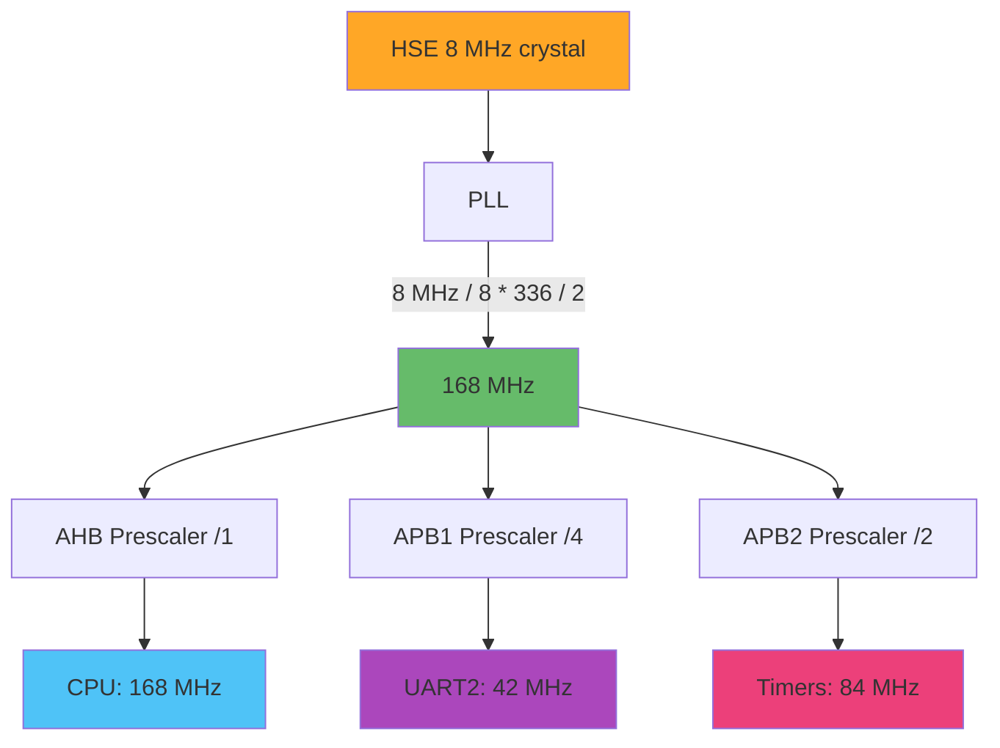

# STM32 Firmware Component Guide

**Component**: STM32F407VET6 Microcontroller  
**Role**: Real-time stellar navigation algorithm execution  
**Outputs**: Attitude quaternions and status via UART

---

## Overview

The STM32 runs the core star identification algorithms and computes spacecraft attitude in real-time. It operates independently from the Raspberry Pi, sending results over UART.

**Responsibilities:**

- Star pattern matching (Triangle algorithm)
- Attitude determination (TRIAD/QUEST)
- Real-time processing (<100ms per frame)
- Binary UART protocol transmission

---

## Hardware Setup

### Board: STM32F407VET6 "Black VET6"

**Specifications:**

- ARM Cortex-M4F @ 168 MHz
- Hardware FPU (critical for performance)
- 512KB Flash, 192KB RAM
- 100-pin LQFP package

**Purchase:**

- Search: "STM32F407VET6 development board"
- Price: $10-20
- Avoid "Mini" versions (different pinout)

### Initial Testing

**Visual Inspection:**

```bash
# Check for:
- Bent pins on headers
- BOOT0/BOOT1 jumpers present
- Two crystals (8MHz + 32.768kHz)
- Micro-USB port intact
```

**Power-On Test:**

```bash
# Connect micro-USB to computer
# LED should illuminate (usually red/blue)

# Enter DFU bootloader mode:
# 1. Set BOOT0=1, BOOT1=0
# 2. Press reset
# 3. Verify device appears:
dfu-util -l
# Should show "STM32 BOOTLOADER"
```

---

## Development Environment Setup

### CMake + ARM Toolchain

**Install toolchain:**

```bash
# Arch Linux
yay -S arm-none-eabi-gcc arm-none-eabi-newlib

# Ubuntu/Debian
sudo apt install gcc-arm-none-eabi binutils-arm-none-eabi

# Verify
arm-none-eabi-gcc --version
```

**Programming tool:**

```bash
# For DFU bootloader
sudo pacman -S dfu-util  # Arch
sudo apt install dfu-util  # Ubuntu

# Flash firmware
dfu-util -a 0 -s 0x08000000:leave -D firmware.bin
```

---

## Clock Configuration

### Maximum Performance Setup

**Target:** 168 MHz system clock with FPU enabled

**Clock Tree:**



**Code (STM32CubeMX generated):**

```c
void SystemClock_Config(void)
{
    RCC_OscInitTypeDef RCC_OscInitStruct = {0};
    RCC_ClkInitTypeDef RCC_ClkInitStruct = {0};

    __HAL_RCC_PWR_CLK_ENABLE();
    __HAL_PWR_VOLTAGESCALING_CONFIG(PWR_REGULATOR_VOLTAGE_SCALE1);

    RCC_OscInitStruct.OscillatorType = RCC_OSCILLATORTYPE_HSE;
    RCC_OscInitStruct.HSEState = RCC_HSE_ON;
    RCC_OscInitStruct.PLL.PLLState = RCC_PLL_ON;
    RCC_OscInitStruct.PLL.PLLSource = RCC_PLLSOURCE_HSE;
    RCC_OscInitStruct.PLL.PLLM = 8;
    RCC_OscInitStruct.PLL.PLLN = 336;
    RCC_OscInitStruct.PLL.PLLP = RCC_PLLP_DIV2;
    RCC_OscInitStruct.PLL.PLLQ = 7;
    HAL_RCC_OscConfig(&RCC_OscInitStruct);

    RCC_ClkInitStruct.ClockType = RCC_CLOCKTYPE_HCLK | RCC_CLOCKTYPE_SYSCLK
                                | RCC_CLOCKTYPE_PCLK1 | RCC_CLOCKTYPE_PCLK2;
    RCC_ClkInitStruct.SYSCLKSource = RCC_SYSCLKSOURCE_PLLCLK;
    RCC_ClkInitStruct.AHBCLKDivider = RCC_SYSCLK_DIV1;
    RCC_ClkInitStruct.APB1CLKDivider = RCC_HCLK_DIV4;
    RCC_ClkInitStruct.APB2CLKDivider = RCC_HCLK_DIV2;
    HAL_RCC_ClockConfig(&RCC_ClkInitStruct, FLASH_LATENCY_5);
}
```

### FPU Activation (Critical!)

**Compiler Flags:**

```makefile
CFLAGS += -mcpu=cortex-m4
CFLAGS += -mthumb
CFLAGS += -mfpu=fpv4-sp-d16
CFLAGS += -mfloat-abi=hard
```

**Runtime Enable:**

```c
// In main() before any floating-point operations
void EnableFPU(void)
{
    // CP10 and CP11 full access
    SCB->CPACR |= ((3UL << 10*2) | (3UL << 11*2));
}
```

**Verification:**

```c
// Test FPU is working
float test = 3.14159f * 2.0f;
if (test > 6.0f && test < 7.0f) {
    printf("FPU working!\n");
}
```

---

## UART Configuration

### UART2 on PA2/PA3

**Pin Assignment:**

- PA2: TX (to Pi GPIO 15)
- PA3: RX (from Pi GPIO 14)
- GND: Common ground

**Configuration:**

```c
void UART2_Init(void)
{
    huart2.Instance = USART2;
    huart2.Init.BaudRate = 115200;
    huart2.Init.WordLength = UART_WORDLENGTH_8B;
    huart2.Init.StopBits = UART_STOPBITS_1;
    huart2.Init.Parity = UART_PARITY_NONE;
    huart2.Init.Mode = UART_MODE_TX_RX;
    huart2.Init.HwFlowCtl = UART_HWCONTROL_NONE;
    huart2.Init.OverSampling = UART_OVERSAMPLING_16;
    HAL_UART_Init(&huart2);
}

void HAL_UART_MspInit(UART_HandleTypeDef* huart)
{
    GPIO_InitTypeDef GPIO_InitStruct = {0};

    if(huart->Instance == USART2)
    {
        __HAL_RCC_USART2_CLK_ENABLE();
        __HAL_RCC_GPIOA_CLK_ENABLE();

        // PA2: USART2_TX, PA3: USART2_RX
        GPIO_InitStruct.Pin = GPIO_PIN_2 | GPIO_PIN_3;
        GPIO_InitStruct.Mode = GPIO_MODE_AF_PP;
        GPIO_InitStruct.Pull = GPIO_PULLUP;
        GPIO_InitStruct.Speed = GPIO_SPEED_FREQ_HIGH;
        GPIO_InitStruct.Alternate = GPIO_AF7_USART2;
        HAL_GPIO_Init(GPIOA, &GPIO_InitStruct);
    }
}
```

---

## Binary Protocol

### Packet Format

**Structure:**

```
[SYNC1][SYNC2][MSG_ID][LENGTH][PAYLOAD...][CRC16]

SYNC1:   0xAA
SYNC2:   0x55
MSG_ID:  1 byte message type
LENGTH:  1 byte payload length
PAYLOAD: Variable length data
CRC16:   CRC-16-CCITT checksum
```

### Message Types

**0x01: Attitude Message**

```c
typedef struct __attribute__((packed)) {
    float quaternion[4];      // w, x, y, z
    float euler[3];           // roll, pitch, yaw (degrees)
    float confidence;         // 0.0 to 1.0
    uint8_t stars_matched;    // Number of stars identified
    uint8_t mode;             // 0=idle, 1=tracking, 2=lost
    uint32_t timestamp_ms;    // Milliseconds since boot
} AttitudePacket_t;
```

**0x02: Status Message**

```c
typedef struct __attribute__((packed)) {
    uint8_t system_state;     // Current operating state
    uint8_t stars_visible;    // Stars detected in FOV
    float processing_time_ms; // Algorithm execution time
    uint32_t uptime_sec;      // System uptime
    uint16_t error_count;     // Cumulative errors
} StatusPacket_t;
```

### Transmission

```c
void SendAttitudePacket(AttitudePacket_t *attitude)
{
    uint8_t buffer[128];
    uint16_t index = 0;

    // Header
    buffer[index++] = 0xAA;
    buffer[index++] = 0x55;
    buffer[index++] = 0x01;  // Attitude message
    buffer[index++] = sizeof(AttitudePacket_t);

    // Payload
    memcpy(&buffer[index], attitude, sizeof(AttitudePacket_t));
    index += sizeof(AttitudePacket_t);

    // CRC
    uint16_t crc = CalculateCRC16(buffer, index);
    buffer[index++] = (crc >> 8) & 0xFF;
    buffer[index++] = crc & 0xFF;

    // Transmit
    HAL_UART_Transmit(&huart2, buffer, index, 100);
}

uint16_t CalculateCRC16(uint8_t *data, uint16_t length)
{
    uint16_t crc = 0xFFFF;

    for (uint16_t i = 0; i < length; i++) {
        crc ^= (uint16_t)data[i] << 8;

        for (uint8_t j = 0; j < 8; j++) {
            if (crc & 0x8000) {
                crc = (crc << 1) ^ 0x1021;  // CRC-16-CCITT polynomial
            } else {
                crc = crc << 1;
            }
        }
    }

    return crc;
}
```

---

## Project Structure

```
firmware/
├── core/
│   ├── inc/
│   │   ├── main.h
│   │   └── stm32f4xx_hal_conf.h
│   └── src/
│       ├── main.c
│       ├── system_stm32f4xx.c
│       └── stm32f4xx_it.c
├── algorithms/
│   ├── triangle.c         # Triangle algorithm
│   ├── triad.c            # TRIAD attitude solver
│   └── quest.c            # QUEST optimizer
├── catalog/
│   ├── star_catalog.h     # Binary star database
│   └── catalog_loader.c   # Memory management
├── comm/
│   ├── uart_protocol.c    # Packet framing
│   └── crc.c              # Checksum functions
└── test/
    └── synthetic_data.c   # Test data generator
```

---

## Memory Management

### Resource Budget

**Flash (512KB):**

- Firmware code: ~100KB
- Star catalog: ~200KB (1000 stars)
- Triangle database: ~150KB
- Reserved: ~62KB

**RAM (192KB):**

- Stack: 16KB
- Heap: 32KB
- Catalog cache: 64KB
- Working buffers: 48KB
- Reserved: 32KB

### Optimization Tips

**Use Flash for Static Data:**

```c
// Store catalog in flash, not RAM
const __attribute__((section(".rodata"))) StarEntry_t catalog[1000] = {
    // Data here
};
```

**Pool Allocators:**

```c
// Pre-allocate buffers
static ObservationBuffer_t obs_pool[MAX_OBSERVATIONS];
static uint8_t pool_usage = 0;

ObservationBuffer_t* AllocateObservation(void) {
    if (pool_usage < MAX_OBSERVATIONS) {
        return &obs_pool[pool_usage++];
    }
    return NULL;
}
```

---

## Performance Targets

| Metric             | Target  | Typical |
| ------------------ | ------- | ------- |
| Lost-in-space time | < 1s    | ~500ms  |
| Tracking update    | < 100ms | ~50ms   |
| Success rate       | > 95%   | ~98%    |
| Power consumption  | < 1W    | ~500mW  |
| CPU utilization    | < 50%   | ~30%    |

---

## Testing & Debugging

### Debug UART

**Additional UART for logging (UART1 on PA9/PA10):**

```c
void DebugPrintf(const char *format, ...)
{
    char buffer[256];
    va_list args;
    va_start(args, format);
    vsnprintf(buffer, sizeof(buffer), format, args);
    va_end(args);

    HAL_UART_Transmit(&huart1, (uint8_t*)buffer, strlen(buffer), 100);
}
```

### Profiling

**Cycle Counter:**

```c
void EnableDWT(void)
{
    CoreDebug->DEMCR |= CoreDebug_DEMCR_TRCENA_Msk;
    DWT->CYCCNT = 0;
    DWT->CTRL |= DWT_CTRL_CYCCNTENA_Msk;
}

uint32_t GetCycles(void)
{
    return DWT->CYCCNT;
}

// Usage
uint32_t start = GetCycles();
TriangleAlgorithm(&observations);
uint32_t end = GetCycles();
uint32_t cycles = end - start;
float ms = (float)cycles / 168000.0f;  // At 168 MHz
```

---

## Troubleshooting

### Issue: No USB device detected

**Solutions:**

- Try different USB cable (data, not charge-only)
- Check BOOT0/BOOT1 jumpers
- Verify 8MHz crystal is oscillating
- Try different USB port

### Issue: FPU hard fault

**Solutions:**

- Verify compiler flags include `-mfloat-abi=hard`
- Enable FPU in startup code before main()
- Check linker script uses correct architecture

### Issue: UART data corruption

**Solutions:**

- Verify baud rate matches on both ends
- Check GPIO alternate function mapping
- Add pull-up resistors if needed
- Verify common ground connection

---

## Next Steps

After STM32 firmware is working:

1. → See `raspberry-pi-setup.md` for Pi configuration
2. → See `hardware-integration.md` for physical connections
3. → See `cfs-integration.md` for Software Bus integration
