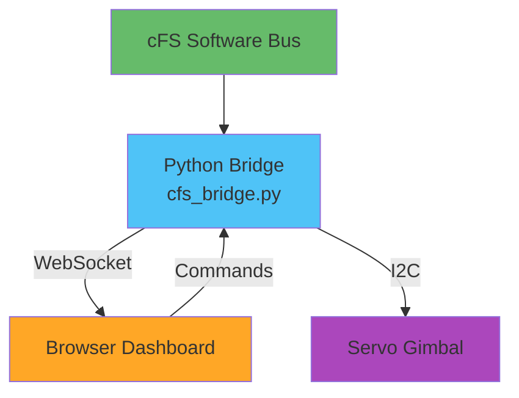

# Web Dashboard Component Guide

**Component**: Flask + WebSocket + Three.js Dashboard  
**Role**: Real-time visualization and system monitoring  
**Displays**: 3D spacecraft model, telemetry, servo control

---

## Overview

The web dashboard provides a real-time interface to visualize spacecraft attitude, monitor telemetry, and control the demonstration gimbal.

**Features:**
- Live 3D spacecraft orientation
- Real-time telemetry graphs
- Servo position visualization
- System status monitoring
- WebSocket-based updates (low latency)

---

## Architecture



---

## Setup

### Create Project Structure

```bash
mkdir -p ~/workspace/stellar-navigation/dashboard/{static,templates}
cd ~/workspace/stellar-navigation/dashboard
```

**Directory layout:**
```
dashboard/
├── cfs_bridge.py          # WebSocket server & cFS interface
├── servo_control.py       # Gimbal control (Pi 5 lgpio)
├── templates/
│   └── dashboard.html     # Web interface
└── static/
    ├── js/
    │   └── spacecraft.js  # Three.js logic
    └── css/
        └── style.css      # Dashboard styling
```

### Python Dependencies

```bash
cd ~/workspace
source starnav-env/bin/activate

pip install \
    flask \
    flask-socketio \
    python-socketio \
    gpiozero \
    lgpio \
    pyserial
```

---

## Servo Control Module

**Create `servo_control.py`:**

```python
#!/usr/bin/env python3
"""
Pi 5 Servo Gimbal Control using lgpio
"""

from gpiozero import Servo
from gpiozero.pins.lgpio import LGPIOFactory
import time

factory = LGPIOFactory()

class ServoGimbal:
    """2-axis gimbal for spacecraft model"""
    
    PAN_PIN = 17    # GPIO 17 for pan (yaw)
    TILT_PIN = 27   # GPIO 27 for tilt (pitch)
    
    PAN_LIMIT = 90   # ±90° pan range
    TILT_LIMIT = 60  # ±60° tilt range
    
    def __init__(self):
        """Initialize servos with lgpio backend"""
        self.pan_servo = Servo(
            self.PAN_PIN,
            min_pulse_width=0.5/1000,
            max_pulse_width=2.5/1000,
            pin_factory=factory
        )
        
        self.tilt_servo = Servo(
            self.TILT_PIN,
            min_pulse_width=0.5/1000,
            max_pulse_width=2.5/1000,
            pin_factory=factory
        )
        
        self.center()
        print("Servo gimbal initialized")
    
    def center(self):
        """Center both servos"""
        self.pan_servo.mid()
        self.tilt_servo.mid()
    
    def set_attitude(self, roll, pitch, yaw):
        """
        Set gimbal position from spacecraft attitude
        
        Args:
            roll: Roll angle in degrees (ignored for 2-axis)
            pitch: Pitch angle (controls tilt)
            yaw: Yaw angle (controls pan)
        """
        # Clamp to mechanical limits
        yaw = max(-self.PAN_LIMIT, min(self.PAN_LIMIT, yaw))
        pitch = max(-self.TILT_LIMIT, min(self.TILT_LIMIT, pitch))
        
        # Convert to servo values (-1 to +1)
        self.pan_servo.value = yaw / self.PAN_LIMIT
        self.tilt_servo.value = pitch / self.TILT_LIMIT
    
    def cleanup(self):
        """Clean shutdown"""
        self.center()
        time.sleep(0.5)
        self.pan_servo.close()
        self.tilt_servo.close()

# Test
if __name__ == '__main__':
    gimbal = ServoGimbal()
    
    try:
        # Sweep test
        for angle in range(-45, 46, 5):
            gimbal.set_attitude(0, angle, angle)
            print(f"Position: Pitch={angle}°, Yaw={angle}°")
            time.sleep(0.2)
        
        gimbal.center()
        print("Test complete")
        
    except KeyboardInterrupt:
        print("\nStopping...")
    finally:
        gimbal.cleanup()
```

---

## Python Bridge Server

**Create `cfs_bridge.py`:**

```python
#!/usr/bin/env python3
"""
cFS Software Bus Bridge
Connects cFS telemetry to WebSocket clients and servo gimbal
"""

import time
import threading
from flask import Flask, render_template
from flask_socketio import SocketIO, emit
from servo_control import ServoGimbal

app = Flask(__name__)
app.config['SECRET_KEY'] = 'stellar-nav-secret'
socketio = SocketIO(app, cors_allowed_origins="*")

class CFSBridge:
    """Bridge between cFS and web clients"""
    
    def __init__(self):
        self.running = False
        self.gimbal = None
        
        # Initialize servo gimbal
        try:
            self.gimbal = ServoGimbal()
        except Exception as e:
            print(f"Servo init failed: {e}")
    
    def start(self):
        """Start reading cFS telemetry"""
        self.running = True
        
        # TODO: Replace with actual cFS Software Bus reading
        # For now, generate test data
        self._test_data_loop()
    
    def _test_data_loop(self):
        """Test data generator"""
        import math
        
        t = 0
        while self.running:
            # Simulate spacecraft motion
            roll = 10 * math.sin(t * 0.1)
            pitch = 15 * math.cos(t * 0.15)
            yaw = 20 * math.sin(t * 0.05)
            
            # Update gimbal
            if self.gimbal:
                try:
                    self.gimbal.set_attitude(roll, pitch, yaw)
                except Exception as e:
                    print(f"Gimbal error: {e}")
            
            # Send to web clients
            data = {
                'quaternion': [0.9, 0.1, 0.2, 0.3],
                'euler': [roll, pitch, yaw],
                'confidence': 0.95,
                'stars_matched': 8,
                'mode': 1,  # Tracking
                'timestamp': time.time()
            }
            
            socketio.emit('attitude_update', data)
            
            t += 0.1
            time.sleep(0.1)  # 10 Hz update

# Global bridge instance
bridge = CFSBridge()

@app.route('/')
def index():
    """Serve dashboard"""
    return render_template('dashboard.html')

@socketio.on('connect')
def handle_connect():
    """Client connected"""
    print('Client connected')
    emit('status', {'connected': True})

@socketio.on('disconnect')
def handle_disconnect():
    """Client disconnected"""
    print('Client disconnected')

@socketio.on('gimbal_command')
def handle_gimbal_command(data):
    """Manual gimbal control"""
    if bridge.gimbal:
        bridge.gimbal.set_attitude(
            data.get('roll', 0),
            data.get('pitch', 0),
            data.get('yaw', 0)
        )

if __name__ == '__main__':
    # Start bridge in background
    bridge_thread = threading.Thread(target=bridge.start, daemon=True)
    bridge_thread.start()
    
    # Run Flask server
    print("Starting dashboard on http://0.0.0.0:5000")
    socketio.run(app, host='0.0.0.0', port=5000, debug=True)
```

---

## Dashboard HTML

**Create `templates/dashboard.html`:**

```html
<!DOCTYPE html>
<html lang="en">
<head>
    <meta charset="UTF-8">
    <meta name="viewport" content="width=device-width, initial-scale=1.0">
    <title>Stellar Navigation Dashboard</title>
    <style>
        * { margin: 0; padding: 0; box-sizing: border-box; }
        
        body {
            font-family: 'Segoe UI', system-ui, sans-serif;
            background: #0a0e27;
            color: #e0e0e0;
            overflow: hidden;
        }
        
        #container {
            display: grid;
            grid-template-columns: 300px 1fr;
            grid-template-rows: 60px 1fr;
            height: 100vh;
            gap: 10px;
            padding: 10px;
        }
        
        #header {
            grid-column: 1 / -1;
            background: linear-gradient(135deg, #1e3c72 0%, #2a5298 100%);
            border-radius: 8px;
            padding: 15px 25px;
            display: flex;
            justify-content: space-between;
            align-items: center;
        }
        
        #sidebar {
            background: #1a1f3a;
            border-radius: 8px;
            padding: 20px;
            overflow-y: auto;
        }
        
        #viewer {
            background: #0f1428;
            border-radius: 8px;
            position: relative;
        }
        
        .telemetry-section {
            margin-bottom: 25px;
        }
        
        .telemetry-section h3 {
            font-size: 14px;
            color: #64b5f6;
            margin-bottom: 10px;
            text-transform: uppercase;
        }
        
        .telemetry-value {
            display: flex;
            justify-content: space-between;
            padding: 8px 0;
            border-bottom: 1px solid #2a3050;
        }
        
        .telemetry-label {
            color: #9e9e9e;
            font-size: 13px;
        }
        
        .telemetry-data {
            font-weight: 600;
            color: #e0e0e0;
        }
        
        .status-badge {
            padding: 5px 15px;
            border-radius: 20px;
            font-size: 12px;
            font-weight: bold;
        }
        
        .status-connected {
            background: #2ecc71;
            color: #fff;
        }
        
        .status-disconnected {
            background: #e74c3c;
            color: #fff;
        }
    </style>
    
    <script src="https://cdnjs.cloudflare.com/ajax/libs/three.js/r128/three.min.js"></script>
    <script src="https://cdn.socket.io/4.5.4/socket.io.min.js"></script>
</head>
<body>
    <div id="container">
        <div id="header">
            <h1>🛰️ Stellar Navigation System</h1>
            <span class="status-badge status-disconnected" id="status">DISCONNECTED</span>
        </div>
        
        <div id="sidebar">
            <div class="telemetry-section">
                <h3>Attitude</h3>
                <div class="telemetry-value">
                    <span class="telemetry-label">Roll</span>
                    <span class="telemetry-data" id="roll">0.0°</span>
                </div>
                <div class="telemetry-value">
                    <span class="telemetry-label">Pitch</span>
                    <span class="telemetry-data" id="pitch">0.0°</span>
                </div>
                <div class="telemetry-value">
                    <span class="telemetry-label">Yaw</span>
                    <span class="telemetry-data" id="yaw">0.0°</span>
                </div>
            </div>
            
            <div class="telemetry-section">
                <h3>Star Tracker</h3>
                <div class="telemetry-value">
                    <span class="telemetry-label">Stars Matched</span>
                    <span class="telemetry-data" id="stars">0</span>
                </div>
                <div class="telemetry-value">
                    <span class="telemetry-label">Confidence</span>
                    <span class="telemetry-data" id="confidence">0%</span>
                </div>
                <div class="telemetry-value">
                    <span class="telemetry-label">Mode</span>
                    <span class="telemetry-data" id="mode">IDLE</span>
                </div>
            </div>
        </div>
        
        <div id="viewer">
            <canvas id="canvas"></canvas>
        </div>
    </div>
    
    <script>
        // WebSocket connection
        const socket = io();
        
        socket.on('connect', () => {
            document.getElementById('status').textContent = 'CONNECTED';
            document.getElementById('status').className = 'status-badge status-connected';
        });
        
        socket.on('disconnect', () => {
            document.getElementById('status').textContent = 'DISCONNECTED';
            document.getElementById('status').className = 'status-badge status-disconnected';
        });
        
        socket.on('attitude_update', (data) => {
            updateTelemetry(data);
            updateSpacecraft(data);
        });
        
        function updateTelemetry(data) {
            document.getElementById('roll').textContent = data.euler[0].toFixed(1) + '°';
            document.getElementById('pitch').textContent = data.euler[1].toFixed(1) + '°';
            document.getElementById('yaw').textContent = data.euler[2].toFixed(1) + '°';
            document.getElementById('stars').textContent = data.stars_matched;
            document.getElementById('confidence').textContent = (data.confidence * 100).toFixed(1) + '%';
            
            const modes = ['IDLE', 'TRACKING', 'LOST'];
            document.getElementById('mode').textContent = modes[data.mode] || 'UNKNOWN';
        }
        
        // Three.js scene
        const scene = new THREE.Scene();
        scene.background = new THREE.Color(0x0f1428);
        
        const canvas = document.getElementById('canvas');
        const camera = new THREE.PerspectiveCamera(45, canvas.clientWidth / canvas.clientHeight, 0.1, 1000);
        camera.position.set(5, 3, 5);
        camera.lookAt(0, 0, 0);
        
        const renderer = new THREE.WebGLRenderer({ canvas, antialias: true });
        renderer.setSize(canvas.clientWidth, canvas.clientHeight);
        
        // Lighting
        scene.add(new THREE.AmbientLight(0xffffff, 0.5));
        const light = new THREE.DirectionalLight(0xffffff, 0.8);
        light.position.set(5, 5, 5);
        scene.add(light);
        
        // Spacecraft model (simple box)
        const geometry = new THREE.BoxGeometry(1, 0.5, 2);
        const material = new THREE.MeshStandardMaterial({ color: 0x4fc3f7 });
        const spacecraft = new THREE.Mesh(geometry, material);
        scene.add(spacecraft);
        
        // Axes helper
        scene.add(new THREE.AxesHelper(2));
        
        function updateSpacecraft(data) {
            const [roll, pitch, yaw] = data.euler.map(d => d * Math.PI / 180);
            spacecraft.rotation.set(pitch, yaw, roll);
        }
        
        function animate() {
            requestAnimationFrame(animate);
            renderer.render(scene, camera);
        }
        animate();
        
        // Handle resize
        window.addEventListener('resize', () => {
            camera.aspect = canvas.clientWidth / canvas.clientHeight;
            camera.updateProjectionMatrix();
            renderer.setSize(canvas.clientWidth, canvas.clientHeight);
        });
    </script>
</body>
</html>
```

---

## Running the Dashboard

### Start Server

```bash
cd ~/workspace/stellar-navigation/dashboard
source ~/workspace/starnav-env/bin/activate
python3 cfs_bridge.py
```

✅ **Expected output:**
```
Servo gimbal initialized
Starting dashboard on http://0.0.0.0:5000
 * Running on all addresses (0.0.0.0)
 * Running on http://127.0.0.1:5000
 * Running on http://192.168.1.100:5000
```

### Access Dashboard

**From same network:**
```
http://starnav-demo.local:5000
http://<pi-ip-address>:5000
```

**From Pi locally:**
```
http://localhost:5000
```

---

## Next Steps

After dashboard is working:
1. → Replace test data with actual cFS Software Bus reading
2. → Add command interface (web → cFS → STM32)
3. → Implement data logging and playback
4. → Add performance graphs with Chart.js

See `cfs-integration.md` for Software Bus interface implementation.
