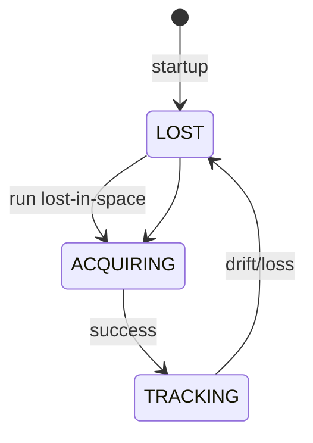

# Stellar Navigation Quick Reference Card

## 🎯 Core Equations

### Angular Distance
```
θ = arccos(b₁ · b₂)
```
- b₁, b₂: unit vectors to stars
- Result: angle in radians

### Pixel to Unit Vector
```
x_mm = (x_px - width/2) × pixel_size
y_mm = (y_px - height/2) × pixel_size
z_mm = focal_length
b = normalize([x_mm, y_mm, z_mm])
```

### Quaternion to Euler
```
Roll:  atan2(2(wz+xy), 1-2(x²+y²))
Pitch: asin(2(wy-xz))  
Yaw:   atan2(2(wz+xy), 1-2(y²+z²))
```

### Centroid (Center of Gravity)
```
x_c = Σ(I_i × x_i) / Σ(I_i)
y_c = Σ(I_i × y_i) / Σ(I_i)
```

## 📦 Key Data Structures

### UART Packet
```
[AA 55] [ID] [LEN] [PAYLOAD...] [CRC16]
```

### Attitude Message (0x01)
```
Quaternion: 4×float (16 bytes)
Confidence: float (4 bytes)
Timestamp:  uint32 (4 bytes)
NumStars:   uint8 (1 byte)
Mode:       uint8 (1 byte)
Total: 26 bytes
```

### Star Catalog Entry
```
ID:        uint16 (2 bytes)
RA:        float (4 bytes)
Dec:       float (4 bytes)
Magnitude: float (4 bytes)
Vector:    3×float (12 bytes)
Total: 26 bytes/star
```

## ⚡ Performance Targets

| Operation | Target Time | With FPU | Without FPU |
|-----------|------------|----------|-------------|
| Angular distance | < 1 µs | ✓ | 10 µs |
| Quaternion multiply | < 5 µs | ✓ | 50 µs |
| Triangle lookup | < 10 ms | - | - |
| TRIAD solve | < 100 µs | ✓ | 1 ms |
| QUEST solve | < 1 ms | ✓ | 10 ms |
| Full identification | < 100 ms | - | - |

## 🔧 Hardware Connections

### UART (STM32 ↔ Pi)
```
STM32 TX (PA2) → Pi RX (GPIO 15)
STM32 RX (PA3) → Pi TX (GPIO 14)
STM32 GND      → Pi GND
```

### I2C (Pi → PCA9685)
```
Pi SDA (GPIO 2) → PCA9685 SDA
Pi SCL (GPIO 3) → PCA9685 SCL
Pi GND          → PCA9685 GND
```

### Servo Power
```
6V Supply → PCA9685 V+
GND       → PCA9685 GND
1000µF cap across power
```

## 🎮 Servo Control

### Angle Mapping
```python
# Gimbal physical limits
pan:  -90° to +90° → 0-180 servo
tilt: -45° to +45° → 45-135 servo

# Conversion
servo_angle = input_angle + 90
```

### I2C Address
- PCA9685: 0x40 (default)
- Channel 0: Pan servo
- Channel 1: Tilt servo

## 📊 Test Metrics

### Success Criteria
- **Identification**: > 95% success
- **Lost-in-Space**: < 1 second
- **Tracking**: < 100 ms
- **Accuracy**: < 0.1° (QUEST)
- **RAM**: < 64 KB
- **CPU**: < 50% @ 168 MHz

### Noise Levels
- **Low**: 0.05 px std dev
- **Medium**: 0.1 px std dev  
- **High**: 0.2 px std dev

### Star Field Density
- **Sparse**: 5-8 stars
- **Nominal**: 10-15 stars
- **Dense**: 15+ stars

## 🛠 Debug Commands

### STM32
```bash
# Flash firmware
st-flash write build/stellar.bin 0x8000000

# Debug console
screen /dev/ttyUSB0 115200
```

### Raspberry Pi
```bash
# Check I2C devices
i2cdetect -y 1

# Monitor UART
cat /dev/ttyAMA0 | xxd

# Test gimbal
python3 test_servo.py
```

### cFS
```bash
# Build
make prep && make && make install

# Run
cd build/exe/cpu1
./core-cpu1
```

## 🐞 Common Issues

| Problem | Likely Cause | Fix |
|---------|-------------|-----|
| No UART data | TX/RX swapped | Swap wires |
| Gimbal jittery | Weak power | Check 6V supply |
| I2C not found | Not enabled | raspi-config |
| CRC failures | Ground missing | Connect GNDs |
| Slow identification | No FPU | Enable in compiler |
| Memory overflow | Catalog too large | Reduce star count |

## 📈 Algorithm Complexity

| Algorithm | Time | Space | Stars |
|-----------|------|-------|-------|
| Triangle | O(1) lookup | O(n³) | 3 |
| Pyramid | O(1) lookup | O(n⁴) | 4 |
| Geometric Vote | O(n²) | O(n) | All |
| Grid | O(n) | O(n²) | All |
| Tracking | O(n) | O(1) | All |

## 🎯 State Machine



## 📝 Message IDs

| ID | Direction | Description |
|----|-----------|-------------|
| 0x01 | STM→Pi | Attitude data |
| 0x02 | STM→Pi | Status |
| 0x03 | STM→Pi | Star catalog |
| 0x10 | Pi→STM | Mode command |
| 0x11 | Pi→STM | Config update |

## 🔗 Key Resources

- **Hipparcos**: 118,218 stars
- **Tycho-2**: 2.5M stars
- **Test generator**: `tools/synthetic_obs.py`
- **CRC-16-CCITT**: Polynomial 0x1021
- **Update rates**: Star tracker 1-10 Hz, IMU 100+ Hz

---
*Keep this card handy during development!*
